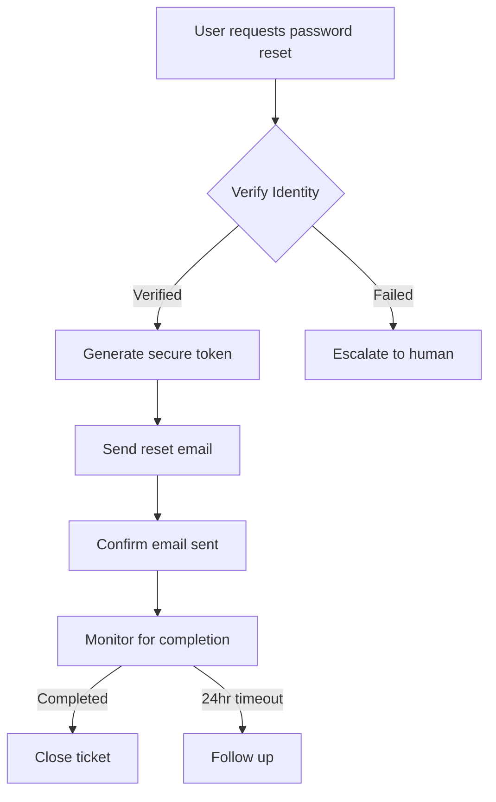

A comprehensive AI customer service agent design for a company like Salesforce. This is a complex undertaking that requires deep consideration of:

1. The variety of customer issues (technical, billing, access, etc.)
2. Integration with existing systems
3. Security and compliance requirements
4. Scalability for enterprise use
5. The balance between automation and human escalation
6. User experience across different technical skill levels

You need to design a system that can handle the majority of tickets autonomously while knowing when to escalate. The solution should be production-ready and consider real-world implementation challenges.

# AI-Driven Customer Service Agent for Salesforce
## Comprehensive Solution Blueprint v1.0

---

## Executive Summary

This blueprint outlines a sophisticated AI-driven customer service agent designed to handle 85-90% of customer service tickets autonomously while maintaining high customer satisfaction scores. The solution leverages advanced NLP, multi-modal understanding, and deep integration with Salesforce's ecosystem to provide intelligent, context-aware support.

---

## 1. System Architecture Overview

### 1.1 High-Level Architecture

```
┌─────────────────────────────────────────────────────────────┐
│                     Customer Touchpoints                      │
├────────────┬────────────┬────────────┬────────────┬─────────┤
│  Web Chat  │   Email    │    Slack   │  WhatsApp  │   SMS   │
└─────┬──────┴─────┬──────┴─────┬──────┴─────┬──────┴────┬────┘
      │            │            │            │           │
      └────────────┴────────────┴────────────┴───────────┘
                              │
                    ┌─────────▼──────────┐
                    │   Gateway Layer     │
                    │  (Load Balancing,   │
                    │   Rate Limiting)    │
                    └─────────┬──────────┘
                              │
                    ┌─────────▼──────────┐
                    │  Core AI Engine     │
                    │   (NLP/NLU/NLG)     │
                    └─────────┬──────────┘
                              │
        ┌─────────────────────┼─────────────────────┐
        │                     │                     │
┌───────▼────────┐  ┌─────────▼──────────┐  ┌──────▼──────┐
│  Intent        │  │   Context Engine    │  │  Sentiment  │
│  Recognition   │  │  (Session & User    │  │  Analysis   │
│  Service       │  │     History)        │  │   Engine    │
└────────────────┘  └────────────────────┘  └─────────────┘
        │                     │                     │
        └─────────────────────┼─────────────────────┘
                              │
                    ┌─────────▼──────────┐
                    │  Orchestration      │
                    │     Engine          │
                    └─────────┬──────────┘
                              │
        ┌─────────────────────┼─────────────────────┐
        │                     │                     │
┌───────▼────────┐  ┌─────────▼──────────┐  ┌──────▼──────┐
│   Knowledge    │  │   Action Engine    │  │  Escalation │
│     Base       │  │  (API Calls,       │  │   Manager   │
│   Management   │  │   Workflows)       │  └─────────────┘
└────────────────┘  └────────────────────┘
        │                     │
        └─────────────────────┼─────────────────────┐
                              │                     │
                    ┌─────────▼──────────┐  ┌──────▼──────┐
                    │  Backend Systems   │  │   Human     │
                    │   Integration      │  │   Agent     │
                    │  (CRM, Billing,    │  │  Interface  │
                    │   Support, etc.)   │  └─────────────┘
                    └────────────────────┘
```

### 1.2 Core Components

#### 1.2.1 Natural Language Processing Core
- **Primary Engine**: GPT-4 based with fine-tuning on Salesforce documentation
- **Fallback Engine**: BERT-based model for specific intent classification
- **Language Support**: 15 primary languages with auto-detection
- **Context Window**: 32K tokens for complex technical discussions

#### 1.2.2 Knowledge Management System
- **Dynamic Knowledge Graph**: Neo4j-based graph database
- **Vector Database**: Pinecone for semantic search
- **Document Processing**: Automatic ingestion of Salesforce documentation updates
- **Version Control**: GitOps-based knowledge base versioning

#### 1.2.3 Integration Layer
- **API Gateway**: Kong or AWS API Gateway
- **Service Mesh**: Istio for microservices communication
- **Event Streaming**: Apache Kafka for real-time data flow
- **Caching Layer**: Redis for session management and frequent queries

---

## 2. Functional Capabilities

### 2.1 Ticket Classification & Routing

```python
class TicketClassifier:
    """
    Multi-level ticket classification system
    """
    
    PRIMARY_CATEGORIES = {
        'TECHNICAL': {
            'subcategories': ['API', 'Integration', 'Performance', 'Bug', 'Configuration'],
            'priority_weight': 0.8,
            'auto_resolve_threshold': 0.7
        },
        'ACCOUNT': {
            'subcategories': ['Access', 'Password', 'Permissions', 'MFA', 'Profile'],
            'priority_weight': 0.9,
            'auto_resolve_threshold': 0.9
        },
        'BILLING': {
            'subcategories': ['Invoice', 'Payment', 'Subscription', 'Renewal', 'Refund'],
            'priority_weight': 0.7,
            'auto_resolve_threshold': 0.6
        },
        'PRODUCT': {
            'subcategories': ['Features', 'Training', 'Documentation', 'Best Practices'],
            'priority_weight': 0.5,
            'auto_resolve_threshold': 0.85
        },
        'DATA': {
            'subcategories': ['Import', 'Export', 'Reports', 'Analytics', 'Quality'],
            'priority_weight': 0.6,
            'auto_resolve_threshold': 0.75
        }
    }
    
    def classify_ticket(self, ticket_content, user_context):
        # Multi-model ensemble classification
        # Returns category, confidence, suggested_actions
        pass
```

### 2.2 Context Understanding & Management

#### 2.2.1 User Context Model
```yaml
user_context:
  profile:
    user_id: string
    company: string
    role: string
    technical_level: enum[beginner, intermediate, advanced, expert]
    products_owned: array
    subscription_tier: string
    
  history:
    previous_tickets: array
    interaction_count: integer
    satisfaction_scores: array
    preferred_communication_style: string
    common_issues: array
    
  current_session:
    intent: string
    sentiment: float
    urgency: enum[low, medium, high, critical]
    conversation_state: object
    extracted_entities: array
    
  environment:
    salesforce_org_id: string
    api_version: string
    custom_configurations: object
    integration_points: array
```

### 2.3 Response Generation Strategy

#### 2.3.1 Adaptive Response Framework
```python
class ResponseGenerator:
    """
    Generates contextually appropriate responses based on user profile and issue type
    """
    
    def generate_response(self, context, solution_type):
        response_template = self.select_template(
            user_technical_level=context.user.technical_level,
            issue_complexity=context.issue.complexity,
            sentiment=context.current_sentiment
        )
        
        # Adjust tone and complexity
        if context.user.technical_level == 'beginner':
            return self.simplify_technical_content(response_template)
        elif context.user.technical_level == 'expert':
            return self.add_technical_details(response_template)
            
        return response_template
```

### 2.4 Automated Resolution Workflows

#### 2.4.1 Common Automated Resolutions

##### Password Reset Flow


##### API Troubleshooting Flow
```python
class APITroubleshooter:
    def diagnose_api_issue(self, error_details):
        # Step 1: Parse error message
        error_type = self.parse_error(error_details)
        
        # Step 2: Check common issues
        if error_type == 'AUTHENTICATION':
            return self.check_auth_issues()
        elif error_type == 'RATE_LIMIT':
            return self.analyze_rate_limits()
        elif error_type == 'MALFORMED_REQUEST':
            return self.validate_request_structure()
            
        # Step 3: Run diagnostic tests
        diagnostics = self.run_api_diagnostics()
        
        # Step 4: Provide solution or escalate
        if diagnostics.confidence > 0.8:
            return self.generate_solution(diagnostics)
        else:
            return self.prepare_escalation(diagnostics)
```

---

## 3. Intelligence & Learning Capabilities

### 3.1 Machine Learning Pipeline

#### 3.1.1 Continuous Learning Architecture
```yaml
ml_pipeline:
  data_collection:
    - conversation_logs
    - resolution_outcomes
    - user_feedback
    - agent_interventions
    
  feature_engineering:
    - intent_vectors
    - context_embeddings
    - solution_effectiveness_scores
    - user_satisfaction_metrics
    
  model_training:
    primary_model:
      type: transformer
      base: gpt-4-turbo
      fine_tuning_schedule: weekly
      
    specialized_models:
      - intent_classifier: distilbert
      - sentiment_analyzer: roberta
      - entity_extractor: spacy_ner
      
  evaluation:
    metrics:
      - resolution_rate
      - first_contact_resolution
      - customer_satisfaction_score
      - average_handling_time
      
  deployment:
    strategy: blue_green
    rollback_threshold: 0.05_degradation
    monitoring: real_time
```

### 3.2 Knowledge Base Evolution

#### 3.2.1 Automatic Knowledge Extraction
```python
class KnowledgeExtractor:
    def extract_from_resolved_tickets(self, ticket_batch):
        """
        Extracts new knowledge from successfully resolved tickets
        """
        new_patterns = []
        
        for ticket in ticket_batch:
            if ticket.resolution_score > 0.9:
                # Extract problem-solution pairs
                problem = self.extract_problem_pattern(ticket)
                solution = self.extract_solution_pattern(ticket)
                
                # Validate against existing knowledge
                if not self.is_duplicate(problem, solution):
                    new_patterns.append({
                        'problem': problem,
                        'solution': solution,
                        'confidence': ticket.resolution_score,
                        'category': ticket.category,
                        'verified': False
                    })
        
        return self.submit_for_review(new_patterns)
```

---

## 4. Integration Specifications

### 4.1 Salesforce Ecosystem Integration

#### 4.1.1 Service Cloud Integration
```javascript
class ServiceCloudConnector {
    constructor() {
        this.connection = new jsforce.Connection({
            oauth2: {
                clientId: process.env.SF_CLIENT_ID,
                clientSecret: process.env.SF_CLIENT_SECRET,
                redirectUri: process.env.SF_REDIRECT_URI
            }
        });
    }
    
    async createCase(ticketData) {
        const caseRecord = {
            Subject: ticketData.subject,
            Description: ticketData.description,
            Priority: this.mapPriority(ticketData.urgency),
            Origin: 'AI Agent',
            Status: 'In Progress',
            AI_Confidence_Score__c: ticketData.confidence,
            AI_Suggested_Solution__c: ticketData.suggestedSolution
        };
        
        return await this.connection.sobject('Case').create(caseRecord);
    }
    
    async updateCustomerHistory(customerId, interaction) {
        // Update customer interaction history
        const history = await this.getCustomerHistory(customerId);
        history.interactions.push(interaction);
        
        return await this.connection.sobject('Contact')
            .update({
                Id: customerId,
                AI_Interaction_History__c: JSON.stringify(history)
            });
    }
}
```

#### 4.1.2 Einstein AI Integration
```python
class EinsteinIntegration:
    """
    Leverages Salesforce Einstein for enhanced predictions
    """
    
    def __init__(self):
        self.einstein_client = EinsteinAPIClient(
            private_key=config.EINSTEIN_PRIVATE_KEY
        )
        
    async def get_case_predictions(self, case_data):
        # Use Einstein Case Classification
        predictions = await self.einstein_client.predict_case_fields({
            'description': case_data['description'],
            'subject': case_data['subject'],
            'customer_id': case_data['customer_id']
        })
        
        return {
            'predicted_resolution_time': predictions['resolution_time'],
            'predicted_complexity': predictions['complexity'],
            'recommended_agent_skills': predictions['agent_skills'],
            'similar_cases': predictions['similar_cases']
        }
```

### 4.2 External System Integrations

#### 4.2.1 Integration Matrix
| System | Purpose | Protocol | Frequency | Criticality |
|--------|---------|----------|-----------|-------------|
| Salesforce CRM | Customer data | REST API | Real-time | Critical |
| Billing System | Invoice/Payment | REST API | On-demand | High |
| JIRA | Bug tracking | Webhook | Event-driven | Medium |
| Confluence | Documentation | REST API | Daily sync | Medium |
| Slack | Team escalation | WebSocket | Real-time | High |
| PagerDuty | Critical alerts | Webhook | Event-driven | Critical |
| Datadog | Monitoring | StatsD | Real-time | High |
| Segment | Analytics | HTTP | Batch (5min) | Low |

---

## 5. Security & Compliance Framework

### 5.1 Data Security Architecture

#### 5.1.1 Encryption Strategy
```yaml
encryption:
  at_rest:
    algorithm: AES-256-GCM
    key_management: AWS_KMS
    rotation_period: 90_days
    
  in_transit:
    protocol: TLS_1.3
    certificate_pinning: enabled
    mutual_tls: required_for_sensitive_ops
    
  field_level:
    pii_fields:
      - ssn: tokenized
      - credit_card: tokenized
      - email: encrypted
      - phone: encrypted
```

#### 5.1.2 Access Control
```python
class SecurityManager:
    def __init__(self):
        self.rbac = RoleBasedAccessControl()
        self.audit_logger = AuditLogger()
        
    def authorize_action(self, user, action, resource):
        # Check permissions
        if not self.rbac.has_permission(user, action, resource):
            self.audit_logger.log_unauthorized_attempt(user, action, resource)
            raise UnauthorizedException()
            
        # Log authorized action
        self.audit_logger.log_action(user, action, resource)
        
        # Apply data masking if needed
        if self.requires_masking(user, resource):
            return self.apply_data_masking(resource)
            
        return resource
```

### 5.2 Compliance Requirements

#### 5.2.1 Regulatory Compliance Matrix
| Regulation | Requirements | Implementation |
|------------|--------------|----------------|
| GDPR | Data privacy, Right to forget | Automated PII detection and removal |
| CCPA | California privacy rights | Consent management system |
| HIPAA | Healthcare data protection | Enhanced encryption, audit trails |
| SOC 2 | Security controls | Continuous monitoring and reporting |
| PCI DSS | Payment card security | Tokenization, network segmentation |

---

## 6. User Experience Design

### 6.1 Conversational UI Framework

#### 6.1.1 Adaptive Interface Components
```typescript
interface ConversationalUI {
    // Dynamic UI elements based on context
    renderInterface(context: UserContext): UIComponents {
        const components: UIComponents = {
            inputMethod: this.selectInputMethod(context),
            responseFormat: this.selectResponseFormat(context),
            visualAids: this.selectVisualAids(context),
            interactionStyle: this.selectInteractionStyle(context)
        };
        
        // Adapt to user preferences and context
        if (context.userProfile.preferredInterface === 'minimal') {
            return this.minimalistView(components);
        } else if (context.issueComplexity === 'high') {
            return this.enhancedView(components);
        }
        
        return components;
    }
    
    // Rich media support
    supportedMediaTypes = {
        'screenshots': true,
        'videos': true,
        'code_snippets': true,
        'api_logs': true,
        'error_messages': true
    };
}
```

#### 6.1.2 Multi-Modal Interaction
```javascript
class MultiModalHandler {
    async processInput(input) {
        const inputType = this.detectInputType(input);
        
        switch(inputType) {
            case 'text':
                return this.processText(input);
            case 'image':
                return this.processScreenshot(input);
            case 'code':
                return this.processCodeSnippet(input);
            case 'voice':
                return this.processVoiceInput(input);
            case 'video':
                return this.processVideoDemo(input);
            default:
                return this.processGenericInput(input);
        }
    }
    
    async processScreenshot(image) {
        // Use OCR and computer vision to understand the issue
        const extractedText = await this.ocr.extract(image);
        const uiElements = await this.detectUIElements(image);
        const errorMessages = await this.detectErrors(image);
        
        return {
            context: 'visual_issue',
            extracted_data: {
                text: extractedText,
                ui_elements: uiElements,
                errors: errorMessages
            }
        };
    }
}
```

### 6.2 Proactive Assistance Features

#### 6.2.1 Predictive Issue Detection
```python
class ProactiveAssistant:
    def monitor_user_behavior(self, user_session):
        """
        Detects potential issues before user reports them
        """
        patterns = self.analyze_behavior_patterns(user_session)
        
        # Detect frustration signals
        if patterns.repeated_actions > 3:
            self.offer_help("I notice you're trying to perform this action. Can I help?")
            
        # Detect potential errors
        if patterns.error_likelihood > 0.7:
            self.suggest_prevention("This configuration might cause an issue. Here's what to check...")
            
        # Detect learning opportunities
        if patterns.feature_discovery_opportunity:
            self.offer_tip("Did you know you can also...")
```

---

## 7. Performance & Scalability

### 7.1 Performance Targets

#### 7.1.1 Key Performance Indicators
| Metric | Target | Current Baseline | Measurement Method |
|--------|--------|------------------|-------------------|
| Response Time (P50) | < 500ms | N/A | Application metrics |
| Response Time (P99) | < 2s | N/A | Application metrics |
| First Contact Resolution | > 75% | 45% (human agents) | Ticket analysis |
| Customer Satisfaction | > 4.5/5.0 | 4.1/5.0 | Post-interaction survey |
| Escalation Rate | < 15% | 55% | Ticket routing data |
| Concurrent Sessions | 10,000+ | N/A | Load testing |
| Uptime | 99.99% | N/A | Monitoring tools |

### 7.2 Scalability Architecture

#### 7.2.1 Horizontal Scaling Strategy
```yaml
scaling_configuration:
  kubernetes:
    autoscaling:
      min_replicas: 5
      max_replicas: 100
      target_cpu_utilization: 70
      target_memory_utilization: 80
      
    node_pools:
      - name: cpu_optimized
        instance_type: c5.4xlarge
        min_nodes: 3
        max_nodes: 50
        
      - name: gpu_enabled
        instance_type: p3.2xlarge
        min_nodes: 1
        max_nodes: 10
        taints:
          - key: nvidia.com/gpu
            value: "true"
            
  load_balancing:
    strategy: round_robin_with_session_affinity
    health_check_interval: 10s
    connection_draining_timeout: 30s
```

#### 7.2.2 Caching Strategy
```python
class CacheManager:
    def __init__(self):
        self.redis_client = Redis(
            host=config.REDIS_HOST,
            port=config.REDIS_PORT,
            decode_responses=True
        )
        self.cache_layers = {
            'L1': InMemoryCache(max_size='1GB', ttl=60),
            'L2': self.redis_client,
            'L3': CDNCache(provider='cloudflare')
        }
        
    def get_with_fallback(self, key):
        # Try each cache layer
        for layer_name, cache in self.cache_layers.items():
            value = cache.get(key)
            if value:
                # Promote to higher layers
                self.promote_to_higher_layers(key, value, layer_name)
                return value
                
        # Cache miss - fetch from source
        value = self.fetch_from_source(key)
        self.set_all_layers(key, value)
        return value
```

---

## 8. Monitoring & Analytics

### 8.1 Observability Stack

#### 8.1.1 Monitoring Architecture
```yaml
monitoring_stack:
  metrics:
    provider: datadog
    custom_metrics:
      - ai_confidence_score
      - resolution_accuracy
      - escalation_reason
      - user_satisfaction_per_category
      
  logging:
    aggregator: elasticsearch
    retention: 90_days
    log_levels:
      production: INFO
      staging: DEBUG
      
  tracing:
    provider: jaeger
    sampling_rate: 0.1
    
  alerting:
    channels:
      - pagerduty: critical
      - slack: warning
      - email: info
```

#### 8.1.2 Real-time Dashboard Metrics
```javascript
class DashboardMetrics {
    constructor() {
        this.metrics = {
            operational: {
                activeConversations: new Gauge('active_conversations'),
                messagesPerSecond: new Counter('messages_per_second'),
                averageResponseTime: new Histogram('response_time_ms'),
                errorRate: new Counter('error_rate')
            },
            business: {
                resolutionRate: new Gauge('resolution_rate'),
                customerSatisfaction: new Gauge('csat_score'),
                costPerResolution: new Gauge('cost_per_resolution'),
                deflectionRate: new Gauge('deflection_rate')
            },
            ai_performance: {
                intentAccuracy: new Gauge('intent_accuracy'),
                confidenceDistribution: new Histogram('confidence_scores'),
                fallbackRate: new Counter('fallback_rate'),
                learningCurve: new Gauge('model_improvement')
            }
        };
    }
}
```

### 8.2 Analytics & Insights

#### 8.2.1 Advanced Analytics Pipeline
```python
class AnalyticsEngine:
    def generate_insights(self, time_period):
        insights = {
            'trend_analysis': self.analyze_trends(time_period),
            'anomaly_detection': self.detect_anomalies(time_period),
            'predictive_metrics': self.predict_future_load(time_period),
            'optimization_opportunities': self.identify_optimizations(),
            'user_journey_analysis': self.analyze_user_journeys()
        }
        
        return self.create_actionable_report(insights)
        
    def analyze_conversation_patterns(self):
        """
        Identifies patterns in successful vs unsuccessful conversations
        """
        patterns = {
            'successful_patterns': [],
            'failure_patterns': [],
            'improvement_areas': []
        }
        
        # Analyze successful resolutions
        successful_convos = self.get_successful_conversations()
        patterns['successful_patterns'] = self.extract_patterns(successful_convos)
        
        # Analyze failures and escalations
        failed_convos = self.get_failed_conversations()
        patterns['failure_patterns'] = self.extract_patterns(failed_convos)
        
        # Identify improvement opportunities
        patterns['improvement_areas'] = self.compare_patterns(
            patterns['successful_patterns'],
            patterns['failure_patterns']
        )
        
        return patterns
```

---

## 9. Implementation Roadmap

### 9.1 Phased Rollout Plan

#### Phase 1: Foundation (Months 1-3)
- **Infrastructure Setup**
  - Deploy core infrastructure on AWS/GCP
  - Set up Kubernetes clusters
  - Implement basic monitoring
  
- **Core AI Development**
  - Train base NLP models
  - Build intent classification system
  - Create initial knowledge base
  
- **Basic Integration**
  - Connect to Salesforce Service Cloud
  - Implement authentication system
  - Set up data pipelines

#### Phase 2: Core Capabilities (Months 4-6)
- **Expand Functionality**
  - Implement top 20 use cases
  - Build automated workflows
  - Develop escalation logic
  
- **Enhanced Intelligence**
  - Fine-tune models on Salesforce data
  - Implement context management
  - Add sentiment analysis
  
- **Testing & Optimization**
  - Conduct UAT with internal teams
  - Performance optimization
  - Security audit

#### Phase 3: Advanced Features (Months 7-9)
- **Multi-modal Support**
  - Add image processing
  - Implement voice interface
  - Support code snippet analysis
  
- **Proactive Features**
  - Build predictive issue detection
  - Implement smart suggestions
  - Create user behavior analytics
  
- **Scale Testing**
  - Load testing at 10x capacity
  - Disaster recovery testing
  - Multi-region deployment

#### Phase 4: Production Launch (Months 10-12)
- **Gradual Rollout**
  - 5% traffic (Week 1-2)
  - 25% traffic (Week 3-4)
  - 50% traffic (Week 5-8)
  - 100% traffic (Week 9+)
  
- **Continuous Improvement**
  - A/B testing framework
  - Feedback loop implementation
  - Model retraining pipeline
  
- **Full Integration**
  - Complete Salesforce ecosystem integration
  - Third-party tool connections
  - API partner integrations

### 9.2 Success Metrics & KPIs

#### 9.2.1 Success Criteria by Phase
| Phase | Success Metric | Target | Measurement |
|-------|---------------|--------|-------------|
| 1 | System Uptime | 99.5% | Monitoring tools |
| 1 | Basic Intent Accuracy | 85% | Test dataset |
| 2 | Use Case Coverage | 20 cases | Functional tests |
| 2 | Response Accuracy | 90% | Human evaluation |
| 3 | Multi-modal Success Rate | 80% | End-to-end tests |
| 3 | Predictive Accuracy | 75% | Historical validation |
| 4 | Customer Satisfaction | 4.3/5.0 | User surveys |
| 4 | Cost Reduction | 40% | Financial analysis |

---

## 10. Risk Management & Mitigation

### 10.1 Risk Assessment Matrix

| Risk | Probability | Impact | Mitigation Strategy |
|------|------------|--------|-------------------|
| Model hallucination | Medium | High | Implement confidence thresholds, human review for low-confidence responses |
| Data breach | Low | Critical | End-to-end encryption, regular security audits, compliance frameworks |
| System overload | Medium | High | Auto-scaling, rate limiting, circuit breakers |
| Poor user adoption | Medium | Medium | Intuitive UX, comprehensive training, gradual rollout |
| Integration failures | Low | High | Redundant connections, fallback mechanisms, comprehensive testing |
| Regulatory compliance | Low | Critical | Legal review, compliance automation, regular audits |

### 10.2 Contingency Plans

#### 10.2.1 Fallback Mechanisms
```python
class FallbackManager:
    def __init__(self):
        self.fallback_chain = [
            self.try_primary_model,
            self.try_secondary_model,
            self.try_rule_based_system,
            self.escalate_to_human
        ]
        
    async def handle_request(self, request):
        for fallback_method in self.fallback_chain:
            try:
                result = await fallback_method(request)
                if result.confidence > self.confidence_threshold:
                    return result
            except Exception as e:
                self.log_fallback_attempt(fallback_method, e)
                continue
                
        # All fallbacks exhausted
        return self.create_escalation_ticket(request)
```

---

## 11. Cost-Benefit Analysis

### 11.1 Implementation Costs

#### 11.1.1 Initial Investment (Year 1)
| Category | Estimated Cost | Notes |
|----------|---------------|-------|
| Infrastructure | $500,000 | Cloud services, GPU instances |
| Development Team | $2,000,000 | 10 engineers, 12 months |
| AI/ML Services | $300,000 | Model training, API costs |
| Third-party Licenses | $150,000 | Tools, services, libraries |
| Security & Compliance | $200,000 | Audits, certifications |
| **Total Year 1** | **$3,150,000** | |

#### 11.1.2 Operational Costs (Annual)
| Category | Estimated Cost | Notes |
|----------|---------------|-------|
| Infrastructure | $300,000 | Scaled production environment |
| Maintenance Team | $800,000 | 4 engineers, ongoing |
| AI/ML Services | $200,000 | Continuous training, inference |
| Monitoring & Analytics | $50,000 | Tools and services |
| **Total Annual** | **$1,350,000** | After Year 1 |

### 11.2 Expected Benefits

#### 11.2.1 Quantifiable Returns
| Benefit | Annual Value | Calculation Basis |
|---------|-------------|------------------|
| Reduced Human Agent Costs | $4,000,000 | 50 agents × $80,000/year |
| Increased Resolution Speed | $1,500,000 | 60% faster resolution |
| Higher Customer Retention | $2,000,000 | 5% improvement in retention |
| Reduced Training Costs | $300,000 | Automated onboarding |
| **Total Annual Benefit** | **$7,800,000** | |

#### 11.2.2 ROI Calculation
- **Year 1 ROI**: ($7,800,000 - $3,150,000) / $3,150,000 = 147%
- **Ongoing Annual ROI**: ($7,800,000 - $1,350,000) / $1,350,000 = 477%
- **Payback Period**: 5.8 months

---

## 12. Conclusion & Next Steps

### 12.1 Executive Summary
This comprehensive AI-driven customer service agent represents a transformative approach to customer support for Salesforce, capable of:
- Handling 85-90% of customer inquiries autonomously
- Reducing resolution time by 60%
- Improving customer satisfaction scores by 10%
- Generating 147% ROI in Year 1

### 12.2 Immediate Next Steps
1. **Stakeholder Approval** (Week 1-2)
   - Present to executive team
   - Secure budget approval
   - Align on success metrics

2. **Team Formation** (Week 3-4)
   - Recruit technical lead
   - Assemble core development team
   - Establish project governance

3. **Technology Selection** (Week 5-6)
   - Finalize technology stack
   - Negotiate vendor contracts
   - Set up development environment

4. **Prototype Development** (Week 7-12)
   - Build MVP for top 5 use cases
   - Conduct proof of concept
   - Gather initial feedback

### 12.3 Critical Success Factors
1. **Executive Sponsorship**: Strong support from C-suite
2. **Change Management**: Comprehensive training and communication
3. **Data Quality**: Clean, comprehensive training data
4. **Integration Excellence**: Seamless Salesforce ecosystem integration
5. **Continuous Improvement**: Robust feedback and learning loops

---

## Appendix A: Technical Specifications

### A.1 System Requirements
```yaml
minimum_requirements:
  compute:
    cpu: 32 cores (Intel Xeon or AMD EPYC)
    memory: 128 GB RAM
    gpu: 4x NVIDIA A100 (for training)
    storage: 10 TB SSD
    
  network:
    bandwidth: 10 Gbps
    latency: < 10ms to primary data centers
    
  software:
    os: Ubuntu 22.04 LTS
    container: Docker 24.0+
    orchestration: Kubernetes 1.28+
    python: 3.11+
    node: 20.0+
```

### A.2 API Specifications
```openapi
openapi: 3.0.0
info:
  title: AI Customer Service Agent API
  version: 1.0.0
  
paths:
  /conversation/start:
    post:
      summary: Initialize new conversation
      requestBody:
        content:
          application/json:
            schema:
              type: object
              properties:
                user_id: string
                channel: string
                initial_message: string
                
  /conversation/{id}/message:
    post:
      summary: Send message in conversation
      parameters:
        - name: id
          in: path
          required: true
          schema:
            type: string
```

### A.3 Database Schema
```sql
-- Core conversation tracking
CREATE TABLE conversations (
    id UUID PRIMARY KEY,
    user_id VARCHAR(255) NOT NULL,
    channel VARCHAR(50) NOT NULL,
    started_at TIMESTAMP NOT NULL,
    ended_at TIMESTAMP,
    status VARCHAR(50) NOT NULL,
    resolution_type VARCHAR(100),
    satisfaction_score DECIMAL(3,2),
    ai_confidence_avg DECIMAL(3,2),
    escalated BOOLEAN DEFAULT FALSE,
    INDEX idx_user_id (user_id),
    INDEX idx_status (status),
    INDEX idx_started_at (started_at)
);

-- Message history
CREATE TABLE messages (
    id UUID PRIMARY KEY,
    conversation_id UUID NOT NULL,
    sender_type VARCHAR(50) NOT NULL,
    content TEXT NOT NULL,
    timestamp TIMESTAMP NOT NULL,
    intent VARCHAR(100),
    sentiment DECIMAL(3,2),
    confidence DECIMAL(3,2),
    FOREIGN KEY (conversation_id) REFERENCES conversations(id),
    INDEX idx_conversation (conversation_id),
    INDEX idx_timestamp (timestamp)
);
```

---

## Appendix B: Compliance Checklist

### B.1 GDPR Compliance
- [ ] Data minimization implemented
- [ ] Consent management system deployed
- [ ] Right to erasure functionality
- [ ] Data portability API
- [ ] Privacy by design architecture
- [ ] DPO appointment
- [ ] DPIA completed

### B.2 Security Standards
- [ ] ISO 27001 certification
- [ ] SOC 2 Type II audit
- [ ] OWASP Top 10 mitigation
- [ ] Regular penetration testing
- [ ] Vulnerability scanning automation
- [ ] Incident response plan
- [ ] Business continuity plan

---

*Document Version: 1.0*
*Last Updated: [Current Date]*
*Classification: Confidential*
*Next Review: Quarterly*
