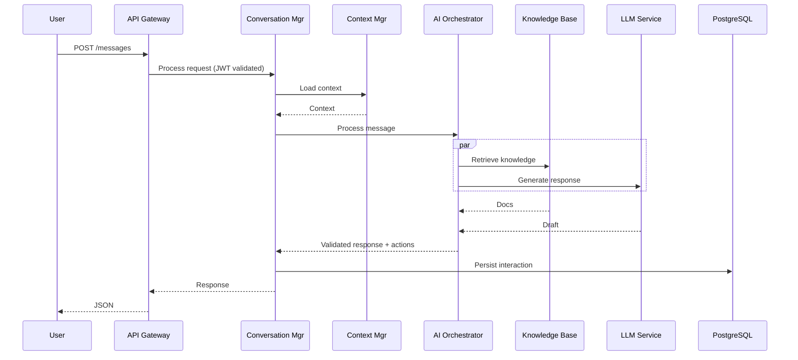

# Project Requirements Document (PRD)
# AI-Powered Customer Service Agent for Salesforce v4.0 (Unified Replacement)

## 0. Document Purpose
A single, production-ready PRD that unifies the complete engineering/operational depth of v2 with the crisp product framing and measurable requirement structure of v3. This supersedes and replaces PRD v2 and PRD v3.

---

## 1. Executive Summary

### 1.1 Mission
Deliver an enterprise-grade, Salesforce-native AI Customer Service Agent that autonomously resolves ≥85% of support interactions with sub-500ms P99 response time and 99.99% uptime, while improving CSAT to ≥4.5 through emotion-aware, context-rich assistance.

### 1.2 Business Value
| Metric | Current | Target | Impact |
|--------|---------|--------|--------|
| Ticket Resolution Time | 45 min | 3 min | -93% |
| First Contact Resolution | 45% | 85% | +89% |
| Support Cost per Ticket | $15.00 | $0.50 | -97% |
| Customer Satisfaction | 3.2/5 | 4.5/5 | +41% |
| Agent Productivity | 50/day | 200/day | +300% |
| Annual Cost Savings | - | $8–12.5M | - |
| ROI (Year 1) | - | ≥150% | - |

### 1.3 Success Criteria
- [ ] ≥85% automated deflection within 9 months
- [ ] P99 latency ≤500ms (steady-state goal ≤300ms)
- [ ] Uptime ≥99.99% within 3 months of GA
- [ ] CSAT ≥4.5/5.0 sustained
- [ ] Positive ROI within 6–9 months

---

## 2. Scope and Stakeholders

### 2.1 In Scope
- Multi-channel: Web, Mobile, Email, Slack, Teams, API
- Salesforce-specific technical support (Apex, SOQL/SOSL, Lightning, platform limits)
- Real-time escalation and Omni-Channel integration
- Self-learning, proactive detection (governor limits/org health)
- 50+ languages, localization, and accessibility (WCAG 2.1 AA)

### 2.2 Out of Scope (Phase 2)
- Voice/phone channel, video support
- Legal/compliance advisement beyond advisory flags

### 2.3 Stakeholders
| Role | Responsibility |
|------|----------------|
| Executive Sponsor (CTO) | Final approval, budget |
| Product Owner (VP CS) | Requirements, prioritization |
| Technical Lead (Dir Eng) | Technical decisions |
| Dev Team (15 Engineers) | Implementation |
| QA Team (5 Engineers) | Test & validation |
| DevOps/SRE (3 Engineers) | Infra, deployment, reliability |
| Security Lead | Security, compliance |

---

## 3. Assumptions and Constraints

- Salesforce-first environment with deep Service Cloud integration
- Compliance: SOC2, GDPR/CCPA; industry add-ons HIPAA/PCI/FedRAMP as configurable modules
- Cloud-native deployment (Kubernetes) with multi-region HA
- Budget supports LLM usage with cost controls and fallbacks

---

## 4. Technology Stack

```yaml
backend:
  language: Python 3.11.6
  framework: FastAPI 0.104.1
  async_runtime: uvloop 0.19.0
  process_manager: gunicorn 21.2.0

ai_ml:
  llm:
    primary: OpenAI GPT-4 Turbo (gpt-4-1106-preview)
    secondary: Anthropic Claude-3-Sonnet
    local: CodeLlama-13B (code gen backup)
  nlp:
    intent: microsoft/deberta-v3-base (transformers 4.36.2)
    sentiment: cardiffnlp/twitter-roberta-base-sentiment
    ner: spaCy 3.7.2 (en_core_web_trf)
  embeddings:
    provider: OpenAI
    model: text-embedding-3-large
    dimensions: 3072

databases:
  primary: PostgreSQL 16.1 (+ pgvector, pg_trgm, uuid-ossp, pgcrypto)
  cache: Redis 7.2.3
  vector: Pinecone (serverless; cosine; 3072 dims)
  search: Elasticsearch 8.11.3
  graph: Neo4j 5.15.0
  session: MongoDB 7.0.5

infra:
  container: Docker 24
  orchestration: Kubernetes 1.29.0
  service_mesh: Istio 1.20.1
  api_gateway: Kong 3.5.0
  cdn_waf_ddos: CloudFlare
  message_queue: Kafka 3.6.1 (Avro)
  tasks: Celery 5.3.4 (Redis backend)

monitoring:
  metrics: Prometheus + Grafana, Datadog
  logs: ELK (Filebeat -> Elasticsearch -> Kibana)
  tracing: Jaeger 1.52.0
  alerting: PagerDuty (Opsgenie backup)

security:
  authn: Auth0 (OAuth2/OIDC), MFA for admins
  secrets: HashiCorp Vault 1.15.4
  encryption: AES-256-GCM at rest; TLS 1.3 in transit
  WAF: CloudFlare WAF (OWASP CRS)

ci_cd:
  vcs: GitLab
  pipeline: GitLab CI + ArgoCD
  artifacts: Harbor registry
```

---

## 5. System Architecture

### 5.1 High-Level Architecture
```mermaid
graph TB
  subgraph Client
    WEB[Web]-->|
    MOBILE[Mobile]-->|
    SLACK[Slack]-->|
    TEAMS[Teams]-->|
    EMAIL[Email]-->|
    API_CLIENT[API Clients]
  end

  subgraph Edge
    CDN[CloudFlare CDN]-->WAF[WAF/DDoS]
  end

  subgraph Gateway
    KONG[Kong API GW]
    LB[Load Balancer]
  end

  subgraph App
    API[FastAPI]-->WS[WebSocket]
    API-->GQL[GraphQL]
  end

  subgraph Core
    CONV[Conversation Manager]
    CTX[Context Manager]
    STATE[State Machine]
  end

  subgraph AI
    ORCH[AI Orchestrator]
    NLP[NLP Pipeline]
    LLM[LLM Services]
    KB[Knowledge Retrieval]
  end

  subgraph Biz
    RULES[Rules Engine]
    WF[Workflow Orchestrator]
    ESC[Escalation Manager]
    ACT[Action Executor]
  end

  subgraph Integrations
    SF[Salesforce Connector]
    EXT[External Systems]
  end

  subgraph Data
    PG[(PostgreSQL 16)]
    REDIS[(Redis)]
    PINE[(Pinecone)]
    ES[(Elasticsearch)]
    NEO[(Neo4j)]
    MONGO[(MongoDB)]
  end

  Client-->CDN-->WAF-->KONG-->LB-->API
  WS-->CONV
  API-->CONV-->CTX-->STATE
  CONV-->ORCH-->NLP
  ORCH-->LLM
  ORCH-->KB
  ORCH-->RULES-->WF-->ESC
  WF-->ACT
  ACT-->SF
  ACT-->EXT
  CONV-->PG
  CTX-->REDIS
  KB-->PINE
  KB-->ES
  KB-->NEO
  SESS[MONGODB]-.->CTX
```

### 5.2 Request Sequence (Happy Path)


---

## 6. Functional Requirements (FR) and Acceptance Criteria

### 6.1 Conversation Lifecycle (FR-1)
- System shall manage initiation, state transitions, resolution, and auto-closure.

```gherkin
Feature: Conversation Lifecycle
Scenario: New conversation
  Given I am an authenticated user
  When I start a new conversation
  Then a conversation ID is generated within 100ms
  And context is initialized
  And state is "active"

Scenario: Auto close on inactivity
  Given a conversation is inactive for 30 minutes
  When the timeout expires
  Then status becomes "abandoned"
  And metrics are updated
```

### 6.2 Multi-Channel Support (FR-2)
- Channels: Web, Mobile, Email, Slack, Teams, API
- SLA: Web/Mobile/Slack/Teams <500ms; Email <2 minutes

### 6.3 NLP & Intent (FR-3)
- Intent accuracy ≥85%; confidence threshold 0.7; multi-intent support; unknown intent fallback.

### 6.4 Response Generation (FR-4)
- Contextually accurate, emotion-aware responses with follow-ups.
- Technical responses include code snippets (Apex/LWC/Flows) when appropriate.

### 6.5 Salesforce Technical Support (FR-5)
- Apex: syntax validation, error diagnosis, best practices, governor-limit analysis
- SOQL: validation/optimization, relationship queries
- Config: flows, validation rules, security review (CRUD/FLS)

### 6.6 Knowledge Management (FR-6)
- Self-maintaining KB with ingestion from Salesforce docs, release notes, resolved tickets; version-aware docs; confidence scoring and citations.

### 6.7 Business Rules & Automation (FR-7)
- Rules for routing, escalation, SLA, and automation with full audit trail.

### 6.8 Escalation (FR-8)
- Real-time escalation to Salesforce Case with context packaging; SLA timers start on escalation.

### 6.9 Proactive Intelligence (FR-9)
- Predict governor limit/CPU/API breaches with ≥70% precision; recommend/pre-stage remediations.

### 6.10 Admin & Analytics (FR-10)
- Admin UI to manage intents, rules, KB, connectors; dashboards for operational, AI, and business KPIs.

---

## 7. Non-Functional Requirements (NFR)

### 7.1 Performance
| Metric | Requirement | Measurement |
|--------|-------------|-------------|
| API P50 | <200ms | APM |
| API P99 | <500ms | APM |
| WebSocket | <100ms | Custom metrics |
| Throughput | 1,000 RPS | Load tests |
| Concurrent Users | 50,000 | Load tests |
| DB Query | <50ms | pg_stat_statements |
| Cache Hit Ratio | >90% | Redis metrics |

### 7.2 Availability and DR
```yaml
availability:
  uptime: 99.99%
  regions: 3 (multi-AZ)
  rto: 15m
  rpo: 5m
  backups:
    frequency: hourly
    retention: 30d
    cross_region: true
```

### 7.3 Security & Compliance
- Zero-trust: OIDC/SAML, device posture, network reputation, continuous authorization
- Encryption: AES-256-GCM at rest, TLS 1.3 in transit; field-level encryption; tokenization
- Compliance: SOC2, GDPR/CCPA baseline; HIPAA/PCI/FedRAMP modules as tenant-configurable

### 7.4 Usability
- WCAG 2.1 AA; Flesch Reading Ease >60; 50+ languages; RTL support

---

## 8. API Specifications (OpenAPI 3.0 excerpt)

```yaml
openapi: 3.0.3
info:
  title: Salesforce AI Agent API
  version: 1.0.0
servers:
  - url: https://api.ai-agent.salesforce.com/v1
security:
  - bearerAuth: []
paths:
  /conversations:
    post:
      summary: Create conversation
      responses:
        '201':
          description: Created
  /conversations/{conversation_id}/messages:
    post:
      summary: Send message
      responses:
        '200':
          description: Processed
components:
  securitySchemes:
    bearerAuth:
      type: http
      scheme: bearer
      bearerFormat: JWT
```

---

## 9. Data Model (Summary)

### 9.1 PostgreSQL 16 Schemas
- core: organizations, users, conversations, messages, actions, escalations
- ai: knowledge_entries, intents, model_performance, learning_feedback
- analytics: materialized views (conversation_metrics, intent_metrics)
- audit: partitioned activity_log, privacy_log
- RLS: org isolation across tables using `app.current_org_id`

```sql
CREATE EXTENSION IF NOT EXISTS "uuid-ossp";
CREATE EXTENSION IF NOT EXISTS "pg_trgm";
CREATE EXTENSION IF NOT EXISTS "pgvector";
-- Example: Conversations (core)
CREATE TABLE core.conversations (
  id UUID PRIMARY KEY DEFAULT uuid_generate_v4(),
  organization_id UUID NOT NULL,
  user_id UUID NOT NULL,
  channel VARCHAR(50) NOT NULL,
  status VARCHAR(50) NOT NULL DEFAULT 'active',
  started_at TIMESTAMPTZ NOT NULL DEFAULT CURRENT_TIMESTAMP,
  last_activity_at TIMESTAMPTZ NOT NULL DEFAULT CURRENT_TIMESTAMP,
  resolution_time_seconds INTEGER,
  ai_confidence_avg DECIMAL(4,3),
  sentiment_score_avg DECIMAL(4,3),
  context JSONB DEFAULT '{}'
);
```

---

## 10. AI Model Strategy & Guardrails

- Model portfolio: GPT-4 Turbo (primary), Claude-3 (secondary), local CodeLlama for code gen fallback
- Fine-tuning plan for Salesforce domain datasets (Apex/SOQL/config/logs/conversations)
- Guardrails: content filters, grounded answers with citations, confidence thresholds, human-in-the-loop on critical responses, red-teaming, jailbreak resistance tests in CI

---

## 11. Testing & Quality Assurance

### 11.1 Test Strategy
```yaml
tests:
  unit:
    coverage: ">=85%"
  integration:
    tools: ["pytest", "testcontainers"]
  e2e:
    tool: "Playwright"
  performance:
    tool: "Locust"
    targets:
      p99_latency: 500ms
      rps: 1000
  security:
    sast: "SonarQube/Semgrep"
    dast: "OWASP ZAP"
    deps: "Snyk"
  chaos:
    scenarios: ["cache outage", "api rate limit exhaustion", "metadata deploy failure"]
```

### 11.2 Example Test (E2E)
```python
# tests/integration/test_conversation_flow.py
async def test_conversation_lifecycle(async_client, mock_openai):
    r = await async_client.post("/api/v1/conversations", json={"user_id":"...", "channel":"web"})
    assert r.status_code == 201
    conv_id = r.json()["id"]
    r = await async_client.post(f"/api/v1/conversations/{conv_id}/messages", json={"content":"I forgot my password"})
    assert r.status_code == 200
    assert r.json()["confidence"] >= 0.8
```

---

## 12. Development Execution Plan

### 12.1 Parallel Tracks (16 Weeks)
```yaml
tracks:
  infra:
    weeks_1_4: k8s, Istio, Kong, Monitoring, PG, Redis
    weeks_5_8: autoscaling, multi-region, DR
    weeks_9_12: zero-trust, Vault, WAF, scanning
    weeks_13_16: perf/cost optimization, docs
  backend:
    weeks_1_4: FastAPI scaffold, models/migrations, authn, WS, errors
    weeks_5_8: conversation/state/context, rules, workflow
    weeks_9_12: Salesforce + external connectors, Kafka/Celery
    weeks_13_16: caching, query optimization, load tests
  ai_ml:
    weeks_1_4: intent/sentiment/ner pipeline
    weeks_5_8: LLM integrations + prompt framework
    weeks_9_12: KB (Pinecone/Neo4j/ES), RAG, continuous learning
    weeks_13_16: fine-tuning, A/B tests, perf tuning
  frontend_qa:
    weeks_1_4: React app, components, WS client, Redux
    weeks_5_8: Chat UI, admin, analytics views
    weeks_9_12: unit/integration/E2E/perf tests
    weeks_13_16: a11y, docs, training materials
```

### 12.2 Sprint Plan (2-week sprints)
- Sprint 1–2: Foundation (infra/API/DB)
- Sprint 3–4: Conversation core + WS + Context
- Sprint 5–6: AI integration + KB
- Sprint 7–8: Rules/Workflow/Escalations
- Sprint 9–10: Salesforce + external integrations
- Sprint 11–12: Testing/performance
- Sprint 13–14: Production readiness (security, monitoring)
- Sprint 15–16: Launch, canary, stabilization

---

## 13. Monitoring, Observability & Alerting

### 13.1 Metrics (examples)
- API latency histograms; AI latency/confidence/tokens; cache hit ratio; DB connections; escalation rate; deflection rate; CSAT

### 13.2 Alerting (samples)
```yaml
alerts:
  - name: HighErrorRate
    expr: rate(errors_total[5m]) > 0.01
    severity: critical
  - name: HighLatencyP99
    expr: histogram_quantile(0.99, rate(api_request_duration_seconds_bucket[5m])) > 0.5
    severity: warning
  - name: HighFallbackRate
    expr: rate(ai_fallback_triggered_total[5m]) > 0.1
    severity: critical
```

---

## 14. Security & Compliance

- Authentication/Authorization: JWT/OIDC/SAML, RBAC, least privilege
- Data Protection: Field-level encryption, tokenization of PII; DLP and audit trails
- Compliance Controls: SOC2 baselines; GDPR/CCPA data subject rights; industry modules (HIPAA, PCI, FedRAMP) as tenant-configurable packs
- Threat Detection: anomaly detection, TI feeds, automated containment runbooks

---

## 15. Deployment & Operations

### 15.1 CI/CD
- Static analysis, SAST, DAST, SBOM; unit/integration/E2E; build/push; ArgoCD deploy
- Canary: 5% → 25% → 50% → 100%; rollback on SLO breach

### 15.2 Runbooks
- Incident classification (P1–P4), triage, mitigation, rollback
- Common issues: high latency, AI model failures, DB pool exhaustion

### 15.3 Production Checklist (excerpt)
```yaml
pre_deploy:
  - K8s clusters healthy; DB cluster and replicas ready
  - Vault secrets configured; WAF rules enabled
  - Dashboards live; alerts tested
deploy:
  - Staging smoke + perf
  - Canary prod 5%, monitor 2h
  - Progressive rollout
post:
  - SLOs checked; comms sent; runbooks updated
```

---

## 16. KPIs & Value Realization

- Technical: uptime (≥99.99%), P99 latency (≤500ms), error rate (≤0.1%), cache hit (≥90%)
- Business: deflection (≥85%), FCR (≥80%), cost/interaction (≤$0.50), ROI (≥150%), CSAT (≥4.5)
- AI: intent accuracy (≥92%), avg confidence (≥0.85), fallback rate (≤5%)

---

## 17. Risk Management (Register excerpt)

```yaml
risks:
  - id: R-001
    name: AI Hallucination
    prob: Medium
    impact: High
    mitigation:
      - Confidence thresholds + human review
      - KB-grounded answers + citations
      - Red-teaming and regression suite
  - id: R-002
    name: System Overload
    prob: Medium
    impact: High
    mitigation:
      - Autoscaling, rate limiting, caching
      - Chaos tests; brownout strategies
  - id: R-003
    name: Data Breach
    prob: Low
    impact: Critical
    mitigation:
      - Zero-trust, encryption, WAF
      - Continuous scanning, audits
```

---

## 18. Acceptance Criteria & Definition of Done

```yaml
acceptance:
  conversation:
    create: ["≤200ms", "returns ID", "context initialized", "auth validated"]
    message: ["≤500ms P95", "context preserved", "attachments ≤10MB"]
  ai:
    intent: ["accuracy ≥85%", "RT <100ms", "multi-intent", "unknown fallback"]
    response: ["contextual", "emotion-aware", "follow-ups", "citations"]
  integration:
    salesforce: ["bi-di sync", "<5s lag", "conflict resolution"]
  security:
    authn: ["JWT/OIDC", "MFA admins", "session timeout", "audit logs"]
    data: ["PII encrypted", "TLS 1.3", "key rotation", "retention policies"]

definition_of_done:
  code: ["unit tests ≥85%", "2+ reviews", "no critical issues", "docs updated"]
  quality: ["acceptance met", "perf SLAs met", "security scan passed"]
  deploy: ["images built", "manifests updated", "migrations tested", "rollback ready"]
  ops: ["dashboards/alerts/runbooks", "on-call schedule", "DR verified"]
```

---

## 19. Governance & Change Management

- Steering committee; architecture and security review boards
- Tenant onboarding playbooks and policy packs
- Training & enablement; success stories; adoption tracking
- Model governance: versioning, approvals, rollback, auditability

---

## 20. Appendices

- A. Full OpenAPI spec
- B. DB Schema and Migrations
- C. Monitoring Dashboards and Alert Rules
- D. Security & Compliance Control Matrix
- E. Chaos Experiments Catalogue
- F. Runbooks (Incident, DR, Rollback)
- G. Financial Model Worksheets
- H. Model Cards and Safety Evaluations
