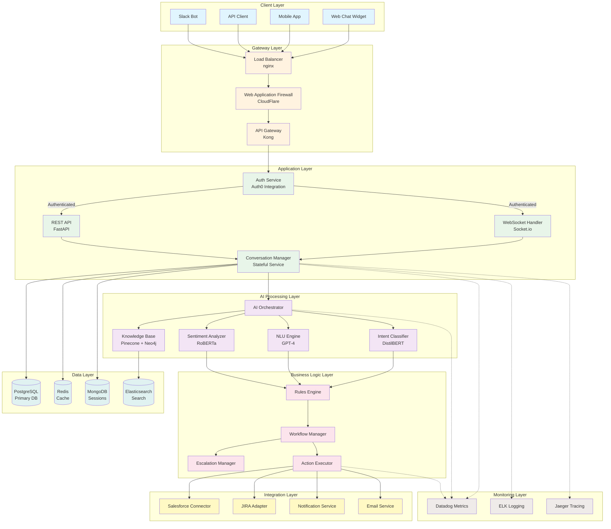
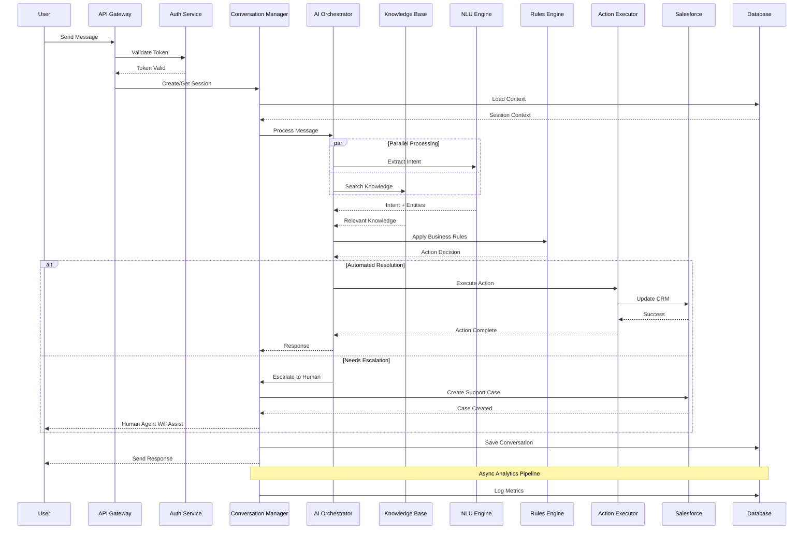

# Project Requirements Document (PRD)
# AI-Driven Customer Service Agent for Salesforce
## Version 3.0 - Technical Implementation Specification

---

## Table of Contents
1. [Executive Summary](#1-executive-summary)
2. [Technology Stack Specification](#2-technology-stack-specification)
3. [System Architecture & Flow](#3-system-architecture--flow)
4. [Code Structure & Organization](#4-code-structure--organization)
5. [Database Schema Design](#5-database-schema-design)
6. [API Specifications](#6-api-specifications)
7. [Development Execution Plan](#7-development-execution-plan)
8. [Testing & Quality Assurance](#8-testing--quality-assurance)
9. [Security Implementation](#9-security-implementation)
10. [Performance Requirements](#10-performance-requirements)
11. [Deployment Specifications](#11-deployment-specifications)
12. [Acceptance Criteria](#12-acceptance-criteria)

---

## 1. Executive Summary

### 1.1 Project Vision
Build a production-grade AI-powered customer service agent that handles 85%+ of Salesforce customer support tickets autonomously while maintaining CSAT scores above 4.5/5.0.

### 1.2 Core Objectives
- **PRIMARY**: Reduce customer service costs by 40% within 12 months
- **SECONDARY**: Improve first contact resolution to 75%+
- **TERTIARY**: Decrease average resolution time to under 5 minutes

### 1.3 Success Metrics
| Metric | Target | Measurement Method | Review Frequency |
|--------|--------|-------------------|------------------|
| Deflection Rate | ≥85% | Automated ticket analysis | Daily |
| CSAT Score | ≥4.5/5.0 | Post-interaction survey | Weekly |
| Response Time P99 | <500ms | Application metrics | Real-time |
| System Uptime | 99.99% | Monitoring tools | Real-time |
| Cost per Resolution | <$0.50 | Financial analysis | Monthly |

---

## 2. Technology Stack Specification

### 2.1 Core Technologies

```yaml
backend:
  language: Python 3.11.5
  framework: FastAPI 0.104.1
  async_runtime: asyncio + uvloop 0.19.0
  
  ai_ml:
    primary_model: OpenAI GPT-4-Turbo (gpt-4-1106-preview)
    fallback_model: Anthropic Claude-3-Sonnet
    embedding_model: text-embedding-3-large
    local_models:
      intent_classifier: transformers 4.35.2 (distilbert-base)
      sentiment_analysis: transformers 4.35.2 (roberta-base)
      ner: spacy 3.7.2 (en_core_web_lg)
  
  database:
    primary: PostgreSQL 16.1
    cache: Redis 7.2.3
    vector: Pinecone (serverless)
    search: Elasticsearch 8.11.1
    graph: Neo4j 5.14.0
    session: MongoDB 7.0.4
  
  message_queue: Apache Kafka 3.6.0
  
frontend:
  framework: React 18.2.0
  language: TypeScript 5.3.2
  state_management: Redux Toolkit 2.0.1
  ui_library: Material-UI 5.14.18
  websocket: Socket.io 4.6.0
  
infrastructure:
  container: Docker 24.0.7
  orchestration: Kubernetes 1.28.4
  service_mesh: Istio 1.20.0
  api_gateway: Kong 3.5.0
  cdn: CloudFlare
  
monitoring:
  metrics: Datadog
  logging: ELK Stack 8.11.1
  tracing: Jaeger 1.51.0
  apm: New Relic
  
security:
  auth: Auth0
  secrets: HashiCorp Vault 1.15.4
  waf: CloudFlare WAF
  scanning: Snyk + OWASP ZAP
  
ci_cd:
  vcs: GitLab 16.6
  ci: GitLab CI
  cd: ArgoCD 2.9.2
  registry: Harbor 2.9.1
```

### 2.2 Development Tools

```yaml
development:
  ide: VSCode with Python + Pylance extensions
  linting:
    - ruff 0.1.6
    - black 23.11.0
    - isort 5.12.0
    - mypy 1.7.1
  testing:
    - pytest 7.4.3
    - pytest-asyncio 0.21.1
    - pytest-cov 4.1.0
    - locust 2.17.0
  documentation:
    - sphinx 7.2.6
    - openapi-generator 7.1.0
  debugging:
    - ipdb 0.13.13
    - py-spy 0.3.14
```

---

## 3. System Architecture & Flow

### 3.1 High-Level System Flow



### 3.2 Detailed Conversation Flow



---

## 4. Code Structure & Organization

### 4.1 Project Directory Structure

```
salesforce-ai-agent/
├── .github/
│   ├── workflows/
│   │   ├── ci.yml
│   │   ├── cd.yml
│   │   └── security-scan.yml
│   └── CODEOWNERS
│
├── src/
│   ├── api/
│   │   ├── __init__.py
│   │   ├── main.py                 # FastAPI application entry point
│   │   ├── dependencies.py         # Dependency injection
│   │   ├── middleware/
│   │   │   ├── __init__.py
│   │   │   ├── auth.py            # Authentication middleware
│   │   │   ├── cors.py            # CORS configuration
│   │   │   ├── rate_limit.py      # Rate limiting
│   │   │   └── error_handler.py   # Global error handling
│   │   ├── routers/
│   │   │   ├── __init__.py
│   │   │   ├── conversations.py   # Conversation endpoints
│   │   │   ├── health.py          # Health check endpoints
│   │   │   ├── admin.py           # Admin endpoints
│   │   │   └── webhooks.py        # Webhook handlers
│   │   └── websocket/
│   │       ├── __init__.py
│   │       ├── manager.py         # WebSocket connection manager
│   │       └── handlers.py        # WebSocket event handlers
│   │
│   ├── core/
│   │   ├── __init__.py
│   │   ├── config.py              # Configuration management
│   │   ├── constants.py           # Application constants
│   │   ├── exceptions.py          # Custom exceptions
│   │   ├── logging.py             # Logging configuration
│   │   └── security.py            # Security utilities
│   │
│   ├── models/
│   │   ├── __init__.py
│   │   ├── base.py               # Base model classes
│   │   ├── conversation.py       # Conversation models
│   │   ├── user.py              # User models
│   │   ├── message.py           # Message models
│   │   └── schemas/
│   │       ├── __init__.py
│   │       ├── request.py       # Request schemas
│   │       └── response.py      # Response schemas
│   │
│   ├── services/
│   │   ├── __init__.py
│   │   ├── conversation/
│   │   │   ├── __init__.py
│   │   │   ├── manager.py       # Conversation state management
│   │   │   ├── context.py       # Context management
│   │   │   └── history.py       # Conversation history
│   │   ├── ai/
│   │   │   ├── __init__.py
│   │   │   ├── orchestrator.py  # AI orchestration logic
│   │   │   ├── nlp/
│   │   │   │   ├── __init__.py
│   │   │   │   ├── intent.py    # Intent classification
│   │   │   │   ├── entities.py  # Entity extraction
│   │   │   │   └── sentiment.py # Sentiment analysis
│   │   │   ├── llm/
│   │   │   │   ├── __init__.py
│   │   │   │   ├── openai.py    # OpenAI integration
│   │   │   │   ├── anthropic.py # Anthropic integration
│   │   │   │   └── fallback.py  # Fallback strategies
│   │   │   └── knowledge/
│   │   │       ├── __init__.py
│   │   │       ├── retriever.py # Knowledge retrieval
│   │   │       ├── indexer.py   # Knowledge indexing
│   │   │       └── graph.py     # Knowledge graph
│   │   ├── business/
│   │   │   ├── __init__.py
│   │   │   ├── rules_engine.py  # Business rules
│   │   │   ├── workflow.py      # Workflow management
│   │   │   ├── escalation.py    # Escalation logic
│   │   │   └── actions.py       # Action execution
│   │   └── integration/
│   │       ├── __init__.py
│   │       ├── salesforce/
│   │       │   ├── __init__.py
│   │       │   ├── client.py    # Salesforce API client
│   │       │   ├── models.py    # Salesforce data models
│   │       │   └── sync.py      # Data synchronization
│   │       ├── jira.py          # JIRA integration
│   │       ├── slack.py         # Slack integration
│   │       └── email.py         # Email service
│   │
│   ├── database/
│   │   ├── __init__.py
│   │   ├── connection.py        # Database connections
│   │   ├── models/
│   │   │   ├── __init__.py
│   │   │   ├── tables.py        # SQLAlchemy models
│   │   │   └── views.py         # Database views
│   │   ├── repositories/
│   │   │   ├── __init__.py
│   │   │   ├── base.py          # Base repository
│   │   │   ├── conversation.py  # Conversation repository
│   │   │   └── user.py          # User repository
│   │   └── migrations/
│   │       ├── alembic.ini
│   │       └── versions/
│   │
│   ├── cache/
│   │   ├── __init__.py
│   │   ├── redis_client.py      # Redis client
│   │   ├── strategies.py        # Caching strategies
│   │   └── decorators.py        # Cache decorators
│   │
│   ├── monitoring/
│   │   ├── __init__.py
│   │   ├── metrics.py           # Metrics collection
│   │   ├── tracing.py           # Distributed tracing
│   │   └── health.py            # Health checks
│   │
│   └── utils/
│       ├── __init__.py
│       ├── validators.py        # Input validation
│       ├── sanitizers.py        # Input sanitization
│       ├── formatters.py        # Output formatting
│       └── helpers.py           # Helper functions
│
├── tests/
│   ├── __init__.py
│   ├── conftest.py              # Pytest configuration
│   ├── unit/
│   │   ├── __init__.py
│   │   ├── test_services/
│   │   ├── test_models/
│   │   └── test_utils/
│   ├── integration/
│   │   ├── __init__.py
│   │   ├── test_api/
│   │   ├── test_database/
│   │   └── test_external/
│   ├── e2e/
│   │   ├── __init__.py
│   │   └── test_conversations.py
│   └── load/
│       ├── __init__.py
│       └── locustfile.py
│
├── scripts/
│   ├── setup.sh                 # Environment setup
│   ├── migrate.py               # Database migrations
│   ├── seed.py                  # Data seeding
│   └── deploy.sh                # Deployment script
│
├── docker/
│   ├── Dockerfile
│   ├── Dockerfile.dev
│   └── docker-compose.yml
│
├── k8s/
│   ├── base/
│   │   ├── namespace.yaml
│   │   ├── configmap.yaml
│   │   └── secrets.yaml
│   ├── deployments/
│   │   ├── api.yaml
│   │   ├── worker.yaml
│   │   └── scheduler.yaml
│   ├── services/
│   │   ├── api-service.yaml
│   │   └── internal-service.yaml
│   ├── ingress/
│   │   └── ingress.yaml
│   └── monitoring/
│       ├── prometheus.yaml
│       └── grafana.yaml
│
├── docs/
│   ├── api/
│   │   └── openapi.yaml
│   ├── architecture/
│   │   └── diagrams/
│   ├── development/
│   │   └── setup.md
│   └── deployment/
│       └── production.md
│
├── .env.example
├── .gitignore
├── pyproject.toml
├── requirements.txt
├── requirements-dev.txt
├── README.md
└── LICENSE
```

### 4.2 Key Module Interfaces

#### 4.2.1 Conversation Manager Interface

```python
# src/services/conversation/manager.py

from typing import Optional, Dict, Any
from datetime import datetime
from uuid import UUID

class ConversationManager:
    """
    Core conversation management service.
    Handles conversation lifecycle, state management, and context switching.
    """
    
    async def create_conversation(
        self,
        user_id: str,
        channel: str,
        initial_message: Optional[str] = None,
        metadata: Optional[Dict[str, Any]] = None
    ) -> Conversation:
        """
        Creates a new conversation session.
        
        Args:
            user_id: Unique user identifier
            channel: Communication channel (web, slack, email, etc.)
            initial_message: Optional first message
            metadata: Additional conversation metadata
            
        Returns:
            Conversation object with unique ID and initial state
            
        Raises:
            ValidationError: If user_id or channel is invalid
            DatabaseError: If conversation creation fails
        """
        pass
    
    async def process_message(
        self,
        conversation_id: UUID,
        message: str,
        attachments: Optional[List[Attachment]] = None
    ) -> ConversationResponse:
        """
        Processes incoming message within conversation context.
        
        Args:
            conversation_id: Unique conversation identifier
            message: User message text
            attachments: Optional file attachments
            
        Returns:
            ConversationResponse containing AI response and actions
            
        Raises:
            ConversationNotFoundError: If conversation doesn't exist
            ProcessingError: If message processing fails
        """
        pass
    
    async def get_conversation_state(
        self,
        conversation_id: UUID
    ) -> ConversationState:
        """
        Retrieves current conversation state.
        
        Args:
            conversation_id: Unique conversation identifier
            
        Returns:
            Current ConversationState object
            
        Raises:
            ConversationNotFoundError: If conversation doesn't exist
        """
        pass
    
    async def update_context(
        self,
        conversation_id: UUID,
        context_updates: Dict[str, Any]
    ) -> None:
        """
        Updates conversation context with new information.
        
        Args:
            conversation_id: Unique conversation identifier
            context_updates: Dictionary of context updates
            
        Raises:
            ConversationNotFoundError: If conversation doesn't exist
            ValidationError: If context updates are invalid
        """
        pass
```

#### 4.2.2 AI Orchestrator Interface

```python
# src/services/ai/orchestrator.py

from typing import List, Optional, Dict, Any
from dataclasses import dataclass

@dataclass
class AIRequest:
    """AI processing request structure"""
    message: str
    context: Dict[str, Any]
    user_profile: UserProfile
    conversation_history: List[Message]
    knowledge_base_enabled: bool = True
    confidence_threshold: float = 0.7

@dataclass
class AIResponse:
    """AI processing response structure"""
    intent: str
    entities: Dict[str, Any]
    sentiment: float
    confidence: float
    suggested_response: str
    suggested_actions: List[Action]
    knowledge_sources: List[KnowledgeSource]
    requires_escalation: bool
    escalation_reason: Optional[str]

class AIOrchestrator:
    """
    Orchestrates AI processing pipeline.
    Coordinates between different AI models and services.
    """
    
    async def process_request(
        self,
        request: AIRequest
    ) -> AIResponse:
        """
        Processes AI request through the full pipeline.
        
        Args:
            request: AIRequest object containing message and context
            
        Returns:
            AIResponse with complete analysis and suggestions
            
        Raises:
            AIProcessingError: If AI processing fails
            ModelTimeoutError: If model inference times out
        """
        pass
    
    async def classify_intent(
        self,
        message: str,
        context: Optional[Dict[str, Any]] = None
    ) -> IntentClassification:
        """
        Classifies message intent using ML models.
        
        Args:
            message: User message text
            context: Optional conversation context
            
        Returns:
            IntentClassification with primary and secondary intents
            
        Raises:
            ClassificationError: If intent classification fails
        """
        pass
    
    async def generate_response(
        self,
        intent: str,
        entities: Dict[str, Any],
        context: Dict[str, Any],
        style: ResponseStyle = ResponseStyle.PROFESSIONAL
    ) -> str:
        """
        Generates appropriate response based on intent and context.
        
        Args:
            intent: Classified intent
            entities: Extracted entities
            context: Conversation context
            style: Response style (professional, friendly, technical)
            
        Returns:
            Generated response text
            
        Raises:
            GenerationError: If response generation fails
        """
        pass
```

#### 4.2.3 Business Rules Engine Interface

```python
# src/services/business/rules_engine.py

from typing import List, Dict, Any, Optional
from enum import Enum

class RuleType(Enum):
    ESCALATION = "escalation"
    ROUTING = "routing"
    AUTOMATION = "automation"
    VALIDATION = "validation"

class RulesEngine:
    """
    Business rules evaluation engine.
    Applies configurable business logic to conversations.
    """
    
    async def evaluate_rules(
        self,
        rule_type: RuleType,
        context: Dict[str, Any]
    ) -> RuleEvaluationResult:
        """
        Evaluates business rules of specified type.
        
        Args:
            rule_type: Type of rules to evaluate
            context: Evaluation context
            
        Returns:
            RuleEvaluationResult with decisions and actions
            
        Raises:
            RuleEvaluationError: If rule evaluation fails
        """
        pass
    
    async def should_escalate(
        self,
        conversation: Conversation,
        ai_response: AIResponse
    ) -> EscalationDecision:
        """
        Determines if conversation should be escalated.
        
        Args:
            conversation: Current conversation
            ai_response: AI analysis response
            
        Returns:
            EscalationDecision with escalation details
        """
        pass
    
    async def determine_routing(
        self,
        ticket_category: str,
        priority: Priority,
        customer_tier: str
    ) -> RoutingDecision:
        """
        Determines optimal routing for support ticket.
        
        Args:
            ticket_category: Classified ticket category
            priority: Ticket priority level
            customer_tier: Customer service tier
            
        Returns:
            RoutingDecision with target queue and SLA
        """
        pass
```

---

## 5. Database Schema Design

### 5.1 PostgreSQL 16 Schema

```sql
-- Enable required extensions
CREATE EXTENSION IF NOT EXISTS "uuid-ossp";
CREATE EXTENSION IF NOT EXISTS "pgcrypto";
CREATE EXTENSION IF NOT EXISTS "pg_trgm";
CREATE EXTENSION IF NOT EXISTS "btree_gin";

-- Create schemas
CREATE SCHEMA IF NOT EXISTS core;
CREATE SCHEMA IF NOT EXISTS analytics;
CREATE SCHEMA IF NOT EXISTS audit;

-- Set default search path
SET search_path TO core, public;

-- ============================================
-- CORE SCHEMA TABLES
-- ============================================

-- Users table
CREATE TABLE core.users (
    id UUID PRIMARY KEY DEFAULT uuid_generate_v4(),
    external_id VARCHAR(255) UNIQUE NOT NULL,
    email VARCHAR(255) NOT NULL,
    organization_id UUID,
    created_at TIMESTAMPTZ NOT NULL DEFAULT CURRENT_TIMESTAMP,
    updated_at TIMESTAMPTZ NOT NULL DEFAULT CURRENT_TIMESTAMP,
    metadata JSONB DEFAULT '{}',
    
    -- Indexes
    INDEX idx_users_email ON core.users(email),
    INDEX idx_users_organization ON core.users(organization_id),
    INDEX idx_users_created_at ON core.users(created_at DESC)
);

-- Organizations table
CREATE TABLE core.organizations (
    id UUID PRIMARY KEY DEFAULT uuid_generate_v4(),
    name VARCHAR(255) NOT NULL,
    salesforce_org_id VARCHAR(255) UNIQUE,
    subscription_tier VARCHAR(50) NOT NULL DEFAULT 'standard',
    settings JSONB DEFAULT '{}',
    created_at TIMESTAMPTZ NOT NULL DEFAULT CURRENT_TIMESTAMP,
    updated_at TIMESTAMPTZ NOT NULL DEFAULT CURRENT_TIMESTAMP,
    
    -- Constraints
    CONSTRAINT chk_subscription_tier CHECK (
        subscription_tier IN ('free', 'standard', 'professional', 'enterprise')
    ),
    
    -- Indexes
    INDEX idx_organizations_salesforce_org ON core.organizations(salesforce_org_id)
);

-- Conversations table
CREATE TABLE core.conversations (
    id UUID PRIMARY KEY DEFAULT uuid_generate_v4(),
    user_id UUID NOT NULL REFERENCES core.users(id) ON DELETE CASCADE,
    channel VARCHAR(50) NOT NULL,
    status VARCHAR(50) NOT NULL DEFAULT 'active',
    started_at TIMESTAMPTZ NOT NULL DEFAULT CURRENT_TIMESTAMP,
    ended_at TIMESTAMPTZ,
    last_activity_at TIMESTAMPTZ NOT NULL DEFAULT CURRENT_TIMESTAMP,
    
    -- Conversation metrics
    message_count INTEGER DEFAULT 0,
    ai_confidence_avg DECIMAL(3,2),
    sentiment_score DECIMAL(3,2),
    
    -- Resolution details
    resolution_type VARCHAR(50),
    resolution_time_seconds INTEGER,
    escalated BOOLEAN DEFAULT FALSE,
    escalation_reason VARCHAR(255),
    
    -- Satisfaction
    satisfaction_score DECIMAL(2,1),
    satisfaction_feedback TEXT,
    
    -- Context and metadata
    context JSONB DEFAULT '{}',
    metadata JSONB DEFAULT '{}',
    
    -- Constraints
    CONSTRAINT chk_status CHECK (
        status IN ('active', 'waiting', 'resolved', 'escalated', 'abandoned')
    ),
    CONSTRAINT chk_channel CHECK (
        channel IN ('web', 'mobile', 'email', 'slack', 'api', 'phone')
    ),
    CONSTRAINT chk_resolution_type CHECK (
        resolution_type IN ('automated', 'human', 'abandoned', 'escalated')
    ),
    
    -- Indexes
    INDEX idx_conversations_user ON core.conversations(user_id),
    INDEX idx_conversations_status ON core.conversations(status),
    INDEX idx_conversations_started_at ON core.conversations(started_at DESC),
    INDEX idx_conversations_last_activity ON core.conversations(last_activity_at DESC),
    INDEX idx_conversations_channel_status ON core.conversations(channel, status)
);

-- Messages table
CREATE TABLE core.messages (
    id UUID PRIMARY KEY DEFAULT uuid_generate_v4(),
    conversation_id UUID NOT NULL REFERENCES core.conversations(id) ON DELETE CASCADE,
    sender_type VARCHAR(20) NOT NULL,
    sender_id VARCHAR(255),
    content TEXT NOT NULL,
    content_type VARCHAR(50) DEFAULT 'text',
    
    -- AI analysis
    intent VARCHAR(100),
    intent_confidence DECIMAL(3,2),
    entities JSONB DEFAULT '[]',
    sentiment DECIMAL(3,2),
    
    -- Message metadata
    created_at TIMESTAMPTZ NOT NULL DEFAULT CURRENT_TIMESTAMP,
    edited_at TIMESTAMPTZ,
    deleted_at TIMESTAMPTZ,
    
    -- Attachments and metadata
    attachments JSONB DEFAULT '[]',
    metadata JSONB DEFAULT '{}',
    
    -- Constraints
    CONSTRAINT chk_sender_type CHECK (
        sender_type IN ('user', 'ai_agent', 'human_agent', 'system')
    ),
    CONSTRAINT chk_content_type CHECK (
        content_type IN ('text', 'image', 'file', 'code', 'error_log')
    ),
    
    -- Indexes
    INDEX idx_messages_conversation ON core.messages(conversation_id),
    INDEX idx_messages_created_at ON core.messages(created_at DESC),
    INDEX idx_messages_intent ON core.messages(intent),
    INDEX idx_messages_content_search ON core.messages USING gin(content gin_trgm_ops)
);

-- Knowledge base entries
CREATE TABLE core.knowledge_entries (
    id UUID PRIMARY KEY DEFAULT uuid_generate_v4(),
    category VARCHAR(100) NOT NULL,
    subcategory VARCHAR(100),
    title VARCHAR(500) NOT NULL,
    content TEXT NOT NULL,
    
    -- Versioning
    version INTEGER NOT NULL DEFAULT 1,
    is_current BOOLEAN DEFAULT TRUE,
    parent_id UUID REFERENCES core.knowledge_entries(id),
    
    -- Metadata
    source VARCHAR(255),
    source_url TEXT,
    confidence_score DECIMAL(3,2) DEFAULT 1.0,
    usage_count INTEGER DEFAULT 0,
    success_rate DECIMAL(3,2),
    
    -- Timestamps
    created_at TIMESTAMPTZ NOT NULL DEFAULT CURRENT_TIMESTAMP,
    updated_at TIMESTAMPTZ NOT NULL DEFAULT CURRENT_TIMESTAMP,
    validated_at TIMESTAMPTZ,
    expires_at TIMESTAMPTZ,
    
    -- Search and metadata
    search_vector tsvector,
    tags TEXT[],
    metadata JSONB DEFAULT '{}',
    
    -- Indexes
    INDEX idx_knowledge_category ON core.knowledge_entries(category, subcategory),
    INDEX idx_knowledge_current ON core.knowledge_entries(is_current) WHERE is_current = TRUE,
    INDEX idx_knowledge_search ON core.knowledge_entries USING gin(search_vector),
    INDEX idx_knowledge_tags ON core.knowledge_entries USING gin(tags)
);

-- Update search vector trigger
CREATE OR REPLACE FUNCTION core.update_knowledge_search_vector()
RETURNS TRIGGER AS $$
BEGIN
    NEW.search_vector := to_tsvector('english', 
        COALESCE(NEW.title, '') || ' ' || 
        COALESCE(NEW.content, '') || ' ' || 
        COALESCE(array_to_string(NEW.tags, ' '), '')
    );
    RETURN NEW;
END;
$$ LANGUAGE plpgsql;

CREATE TRIGGER trigger_update_knowledge_search
    BEFORE INSERT OR UPDATE ON core.knowledge_entries
    FOR EACH ROW
    EXECUTE FUNCTION core.update_knowledge_search_vector();

-- Actions table (for tracking automated actions)
CREATE TABLE core.actions (
    id UUID PRIMARY KEY DEFAULT uuid_generate_v4(),
    conversation_id UUID REFERENCES core.conversations(id) ON DELETE CASCADE,
    action_type VARCHAR(100) NOT NULL,
    status VARCHAR(50) NOT NULL DEFAULT 'pending',
    
    -- Action details
    parameters JSONB DEFAULT '{}',
    result JSONB DEFAULT '{}',
    error_message TEXT,
    
    -- Timing
    created_at TIMESTAMPTZ NOT NULL DEFAULT CURRENT_TIMESTAMP,
    started_at TIMESTAMPTZ,
    completed_at TIMESTAMPTZ,
    duration_ms INTEGER,
    
    -- Retry logic
    retry_count INTEGER DEFAULT 0,
    max_retries INTEGER DEFAULT 3,
    next_retry_at TIMESTAMPTZ,
    
    -- Constraints
    CONSTRAINT chk_action_status CHECK (
        status IN ('pending', 'running', 'completed', 'failed', 'cancelled')
    ),
    
    -- Indexes
    INDEX idx_actions_conversation ON core.actions(conversation_id),
    INDEX idx_actions_status ON core.actions(status),
    INDEX idx_actions_type_status ON core.actions(action_type, status)
);

-- Escalations table
CREATE TABLE core.escalations (
    id UUID PRIMARY KEY DEFAULT uuid_generate_v4(),
    conversation_id UUID NOT NULL REFERENCES core.conversations(id),
    reason VARCHAR(255) NOT NULL,
    priority VARCHAR(20) NOT NULL DEFAULT 'medium',
    
    -- Assignment
    assigned_to VARCHAR(255),
    assigned_at TIMESTAMPTZ,
    queue_name VARCHAR(100),
    
    -- Timing
    created_at TIMESTAMPTZ NOT NULL DEFAULT CURRENT_TIMESTAMP,
    resolved_at TIMESTAMPTZ,
    sla_deadline TIMESTAMPTZ,
    
    -- Resolution
    resolution_notes TEXT,
    resolved_by VARCHAR(255),
    
    -- Metadata
    context JSONB DEFAULT '{}',
    metadata JSONB DEFAULT '{}',
    
    -- Constraints
    CONSTRAINT chk_priority CHECK (
        priority IN ('low', 'medium', 'high', 'critical')
    ),
    
    -- Indexes
    INDEX idx_escalations_conversation ON core.escalations(conversation_id),
    INDEX idx_escalations_priority_created ON core.escalations(priority, created_at DESC),
    INDEX idx_escalations_assigned_to ON core.escalations(assigned_to)
);

-- ============================================
-- ANALYTICS SCHEMA TABLES
-- ============================================

-- Conversation metrics (materialized view for performance)
CREATE MATERIALIZED VIEW analytics.conversation_metrics AS
SELECT
    DATE_TRUNC('hour', c.started_at) as hour,
    c.channel,
    COUNT(*) as conversation_count,
    AVG(c.resolution_time_seconds) as avg_resolution_time,
    AVG(c.message_count) as avg_message_count,
    AVG(c.ai_confidence_avg) as avg_confidence,
    AVG(c.satisfaction_score) as avg_satisfaction,
    SUM(CASE WHEN c.escalated THEN 1 ELSE 0 END) as escalation_count,
    SUM(CASE WHEN c.resolution_type = 'automated' THEN 1 ELSE 0 END) as automated_count
FROM core.conversations c
WHERE c.started_at >= CURRENT_DATE - INTERVAL '30 days'
GROUP BY DATE_TRUNC('hour', c.started_at), c.channel;

-- Create index on materialized view
CREATE INDEX idx_conversation_metrics_hour ON analytics.conversation_metrics(hour DESC);

-- Refresh materialized view function
CREATE OR REPLACE FUNCTION analytics.refresh_conversation_metrics()
RETURNS void AS $$
BEGIN
    REFRESH MATERIALIZED VIEW CONCURRENTLY analytics.conversation_metrics;
END;
$$ LANGUAGE plpgsql;

-- Intent patterns table
CREATE TABLE analytics.intent_patterns (
    id UUID PRIMARY KEY DEFAULT uuid_generate_v4(),
    intent VARCHAR(100) NOT NULL,
    pattern TEXT NOT NULL,
    frequency INTEGER DEFAULT 1,
    success_rate DECIMAL(3,2),
    avg_resolution_time INTEGER,
    last_seen TIMESTAMPTZ NOT NULL DEFAULT CURRENT_TIMESTAMP,
    
    -- Indexes
    INDEX idx_intent_patterns_intent ON analytics.intent_patterns(intent),
    INDEX idx_intent_patterns_frequency ON analytics.intent_patterns(frequency DESC)
);

-- ============================================
-- AUDIT SCHEMA TABLES
-- ============================================

-- Audit log table
CREATE TABLE audit.activity_log (
    id UUID PRIMARY KEY DEFAULT uuid_generate_v4(),
    timestamp TIMESTAMPTZ NOT NULL DEFAULT CURRENT_TIMESTAMP,
    user_id UUID,
    action VARCHAR(100) NOT NULL,
    resource_type VARCHAR(50),
    resource_id UUID,
    ip_address INET,
    user_agent TEXT,
    details JSONB DEFAULT '{}',
    
    -- Indexes
    INDEX idx_activity_log_timestamp ON audit.activity_log(timestamp DESC),
    INDEX idx_activity_log_user ON audit.activity_log(user_id),
    INDEX idx_activity_log_action ON audit.activity_log(action)
) PARTITION BY RANGE (timestamp);

-- Create monthly partitions for audit log
CREATE TABLE audit.activity_log_2024_01 PARTITION OF audit.activity_log
    FOR VALUES FROM ('2024-01-01') TO ('2024-02-01');

-- Function to automatically create monthly partitions
CREATE OR REPLACE FUNCTION audit.create_monthly_partition()
RETURNS void AS $$
DECLARE
    partition_name TEXT;
    start_date DATE;
    end_date DATE;
BEGIN
    start_date := DATE_TRUNC('month', CURRENT_DATE + INTERVAL '1 month');
    end_date := start_date + INTERVAL '1 month';
    partition_name := 'activity_log_' || TO_CHAR(start_date, 'YYYY_MM');
    
    EXECUTE format(
        'CREATE TABLE IF NOT EXISTS audit.%I PARTITION OF audit.activity_log FOR VALUES FROM (%L) TO (%L)',
        partition_name, start_date, end_date
    );
END;
$$ LANGUAGE plpgsql;

-- ============================================
-- PERFORMANCE OPTIMIZATIONS
-- ============================================

-- Create composite indexes for common queries
CREATE INDEX idx_conversations_user_status_activity 
    ON core.conversations(user_id, status, last_activity_at DESC);

CREATE INDEX idx_messages_conversation_created 
    ON core.messages(conversation_id, created_at DESC);

-- Create partial indexes for active conversations
CREATE INDEX idx_active_conversations 
    ON core.conversations(user_id, last_activity_at DESC) 
    WHERE status = 'active';

-- Create GIN index for JSONB queries
CREATE INDEX idx_conversations_metadata_gin 
    ON core.conversations USING gin(metadata);

CREATE INDEX idx_messages_entities_gin 
    ON core.messages USING gin(entities);

-- ============================================
-- ROW LEVEL SECURITY
-- ============================================

-- Enable RLS on sensitive tables
ALTER TABLE core.users ENABLE ROW LEVEL SECURITY;
ALTER TABLE core.conversations ENABLE ROW LEVEL SECURITY;
ALTER TABLE core.messages ENABLE ROW LEVEL SECURITY;

-- Create policies
CREATE POLICY users_isolation ON core.users
    FOR ALL
    USING (organization_id = current_setting('app.current_org_id')::UUID);

CREATE POLICY conversations_isolation ON core.conversations
    FOR ALL
    USING (
        user_id IN (
            SELECT id FROM core.users 
            WHERE organization_id = current_setting('app.current_org_id')::UUID
        )
    );

-- ============================================
-- STORED PROCEDURES
-- ============================================

-- Procedure to close inactive conversations
CREATE OR REPLACE PROCEDURE core.close_inactive_conversations()
LANGUAGE plpgsql
AS $$
BEGIN
    UPDATE core.conversations
    SET 
        status = 'abandoned',
        ended_at = CURRENT_TIMESTAMP,
        resolution_type = 'abandoned'
    WHERE 
        status = 'active' 
        AND last_activity_at < CURRENT_TIMESTAMP - INTERVAL '24 hours';
        
    COMMIT;
END;
$$;

-- Function to calculate conversation statistics
CREATE OR REPLACE FUNCTION core.get_conversation_stats(
    p_conversation_id UUID
) RETURNS TABLE (
    total_messages INTEGER,
    user_messages INTEGER,
    ai_messages INTEGER,
    avg_response_time_seconds NUMERIC,
    unique_intents INTEGER,
    escalation_count INTEGER
) AS $$
BEGIN
    RETURN QUERY
    SELECT
        COUNT(*)::INTEGER as total_messages,
        SUM(CASE WHEN sender_type = 'user' THEN 1 ELSE 0 END)::INTEGER as user_messages,
        SUM(CASE WHEN sender_type = 'ai_agent' THEN 1 ELSE 0 END)::INTEGER as ai_messages,
        AVG(
            EXTRACT(EPOCH FROM (
                LEAD(created_at) OVER (ORDER BY created_at) - created_at
            ))
        )::NUMERIC as avg_response_time_seconds,
        COUNT(DISTINCT intent)::INTEGER as unique_intents,
        (SELECT COUNT(*) FROM core.escalations WHERE conversation_id = p_conversation_id)::INTEGER
    FROM core.messages
    WHERE conversation_id = p_conversation_id;
END;
$$ LANGUAGE plpgsql;
```

---

## 6. API Specifications

### 6.1 REST API Endpoints

```yaml
openapi: 3.0.3
info:
  title: Salesforce AI Agent API
  version: 1.0.0
  description: AI-powered customer service agent API

servers:
  - url: https://api.ai-agent.salesforce.com/v1
    description: Production server
  - url: https://staging-api.ai-agent.salesforce.com/v1
    description: Staging server

paths:
  /conversations:
    post:
      summary: Create new conversation
      operationId: createConversation
      tags:
        - Conversations
      requestBody:
        required: true
        content:
          application/json:
            schema:
              type: object
              required:
                - user_id
                - channel
              properties:
                user_id:
                  type: string
                  format: uuid
                channel:
                  type: string
                  enum: [web, mobile, email, slack, api]
                initial_message:
                  type: string
                  maxLength: 5000
                metadata:
                  type: object
      responses:
        '201':
          description: Conversation created
          content:
            application/json:
              schema:
                $ref: '#/components/schemas/Conversation'
        '400':
          $ref: '#/components/responses/BadRequest'
        '401':
          $ref: '#/components/responses/Unauthorized'
        '429':
          $ref: '#/components/responses/RateLimited'

  /conversations/{conversation_id}/messages:
    post:
      summary: Send message in conversation
      operationId: sendMessage
      tags:
        - Messages
      parameters:
        - name: conversation_id
          in: path
          required: true
          schema:
            type: string
            format: uuid
      requestBody:
        required: true
        content:
          application/json:
            schema:
              type: object
              required:
                - content
              properties:
                content:
                  type: string
                  maxLength: 5000
                content_type:
                  type: string
                  enum: [text, image, file, code]
                  default: text
                attachments:
                  type: array
                  items:
                    $ref: '#/components/schemas/Attachment'
      responses:
        '200':
          description: Message processed
          content:
            application/json:
              schema:
                $ref: '#/components/schemas/MessageResponse'
        '404':
          $ref: '#/components/responses/NotFound'

  /conversations/{conversation_id}:
    get:
      summary: Get conversation details
      operationId: getConversation
      tags:
        - Conversations
      parameters:
        - name: conversation_id
          in: path
          required: true
          schema:
            type: string
            format: uuid
      responses:
        '200':
          description: Conversation details
          content:
            application/json:
              schema:
                $ref: '#/components/schemas/ConversationDetail'

  /health:
    get:
      summary: Health check
      operationId: healthCheck
      tags:
        - System
      responses:
        '200':
          description: System healthy
          content:
            application/json:
              schema:
                type: object
                properties:
                  status:
                    type: string
                    enum: [healthy, degraded, unhealthy]
                  version:
                    type: string
                  timestamp:
                    type: string
                    format: date-time

components:
  schemas:
    Conversation:
      type: object
      properties:
        id:
          type: string
          format: uuid
        user_id:
          type: string
          format: uuid
        channel:
          type: string
        status:
          type: string
          enum: [active, waiting, resolved, escalated]
        created_at:
          type: string
          format: date-time

    MessageResponse:
      type: object
      properties:
        message_id:
          type: string
          format: uuid
        response:
          type: string
        intent:
          type: string
        confidence:
          type: number
          format: float
        suggested_actions:
          type: array
          items:
            $ref: '#/components/schemas/Action'
        requires_escalation:
          type: boolean

  securitySchemes:
    bearerAuth:
      type: http
      scheme: bearer
      bearerFormat: JWT

security:
  - bearerAuth: []
```

### 6.2 WebSocket Events

```typescript
// WebSocket Event Definitions
// src/api/websocket/events.ts

export enum WebSocketEvent {
    // Client -> Server
    CONNECT = 'connect',
    DISCONNECT = 'disconnect',
    MESSAGE = 'message',
    TYPING = 'typing',
    READ_RECEIPT = 'read_receipt',
    
    // Server -> Client
    MESSAGE_RECEIVED = 'message_received',
    AI_RESPONSE = 'ai_response',
    TYPING_INDICATOR = 'typing_indicator',
    STATUS_UPDATE = 'status_update',
    ERROR = 'error'
}

export interface MessageEvent {
    conversation_id: string;
    content: string;
    attachments?: Attachment[];
}

export interface AIResponseEvent {
    message_id: string;
    response: string;
    intent: string;
    confidence: number;
    actions?: Action[];
}

export interface StatusUpdateEvent {
    conversation_id: string;
    status: ConversationStatus;
    reason?: string;
}
```

---

## 7. Development Execution Plan

### 7.1 Phase-Based Development Plan

#### Phase 1: Foundation (Weeks 1-4)
**Goal**: Establish core infrastructure and basic conversation handling

```yaml
phase_1:
  week_1:
    infrastructure:
      - Set up development environment
      - Configure GitLab repository and CI/CD
      - Initialize Docker containers
      - Set up PostgreSQL and Redis
      
    tasks:
      - task: Setup development environment
        owner: DevOps Lead
        dependencies: []
        deliverable: docker-compose.yml
        
      - task: Database schema implementation
        owner: Backend Lead
        dependencies: [environment_setup]
        deliverable: Migration scripts
        
  week_2:
    api_foundation:
      - FastAPI application structure
      - Basic authentication
      - Database connections
      - Redis cache setup
      
    tasks:
      - task: API scaffold
        owner: Backend Developer 1
        dependencies: [database_schema]
        deliverable: src/api/main.py
        
      - task: Auth middleware
        owner: Backend Developer 2
        dependencies: [api_scaffold]
        deliverable: src/api/middleware/auth.py
        
  week_3:
    conversation_management:
      - Conversation CRUD operations
      - Message handling
      - Session management
      
    tasks:
      - task: Conversation service
        owner: Backend Developer 1
        dependencies: [api_foundation]
        deliverable: src/services/conversation/
        
      - task: WebSocket implementation
        owner: Backend Developer 3
        dependencies: [api_foundation]
        deliverable: src/api/websocket/
        
  week_4:
    testing_monitoring:
      - Unit test framework
      - Integration tests
      - Basic monitoring
      
    tasks:
      - task: Test suite setup
        owner: QA Lead
        dependencies: [conversation_service]
        deliverable: tests/
        
      - task: Monitoring setup
        owner: DevOps Engineer
        dependencies: [api_foundation]
        deliverable: Datadog integration

validation_criteria:
  - API can create and retrieve conversations
  - WebSocket connections work
  - Database operations successful
  - 80% code coverage
  - All endpoints have tests
```

#### Phase 2: AI Integration (Weeks 5-8)
**Goal**: Integrate AI models and implement intelligent response generation

```yaml
phase_2:
  week_5:
    model_integration:
      - OpenAI GPT-4 integration
      - Intent classifier setup
      - Sentiment analysis
      
    tasks:
      - task: LLM integration
        owner: ML Engineer 1
        dependencies: [conversation_service]
        deliverable: src/services/ai/llm/
        
      - task: Intent classifier
        owner: ML Engineer 2
        dependencies: [conversation_service]
        deliverable: src/services/ai/nlp/intent.py
        
  week_6:
    knowledge_base:
      - Vector database setup
      - Knowledge retrieval
      - RAG implementation
      
    tasks:
      - task: Pinecone integration
        owner: Backend Developer 1
        dependencies: [llm_integration]
        deliverable: src/services/ai/knowledge/
        
      - task: Document ingestion
        owner: Backend Developer 2
        dependencies: [pinecone_integration]
        deliverable: scripts/ingest_knowledge.py
        
  week_7:
    orchestration:
      - AI orchestrator implementation
      - Fallback strategies
      - Response generation
      
    tasks:
      - task: AI orchestrator
        owner: ML Engineer 1
        dependencies: [all_ai_components]
        deliverable: src/services/ai/orchestrator.py
        
      - task: Fallback handling
        owner: Backend Developer 3
        dependencies: [orchestrator]
        deliverable: Fallback logic
        
  week_8:
    ai_testing:
      - AI model testing
      - Accuracy validation
      - Performance benchmarking
      
    tasks:
      - task: Model evaluation
        owner: ML Engineer 2
        dependencies: [orchestrator]
        deliverable: Model metrics report
        
      - task: Load testing AI
        owner: QA Engineer
        dependencies: [orchestrator]
        deliverable: Performance report

validation_criteria:
  - AI responds to 20 test scenarios correctly
  - Intent classification accuracy >85%
  - Response time <2s for 95% of requests
  - Fallback mechanisms work
  - Knowledge retrieval functional
```

#### Phase 3: Business Logic (Weeks 9-12)
**Goal**: Implement business rules, workflows, and Salesforce integration

```yaml
phase_3:
  week_9:
    rules_engine:
      - Business rules implementation
      - Escalation logic
      - Routing decisions
      
    tasks:
      - task: Rules engine
        owner: Backend Developer 1
        dependencies: [ai_orchestrator]
        deliverable: src/services/business/rules_engine.py
        
      - task: Escalation manager
        owner: Backend Developer 2
        dependencies: [rules_engine]
        deliverable: src/services/business/escalation.py
        
  week_10:
    salesforce_integration:
      - Salesforce API client
      - Case creation/update
      - Data synchronization
      
    tasks:
      - task: Salesforce connector
        owner: Integration Developer
        dependencies: [business_logic]
        deliverable: src/services/integration/salesforce/
        
      - task: Sync mechanism
        owner: Backend Developer 3
        dependencies: [salesforce_connector]
        deliverable: Data sync service
        
  week_11:
    workflow_automation:
      - Action execution
      - Workflow management
      - Automated responses
      
    tasks:
      - task: Action executor
        owner: Backend Developer 1
        dependencies: [salesforce_integration]
        deliverable: src/services/business/actions.py
        
      - task: Workflow engine
        owner: Backend Developer 2
        dependencies: [action_executor]
        deliverable: src/services/business/workflow.py
        
  week_12:
    integration_testing:
      - End-to-end testing
      - Integration validation
      - User acceptance testing
      
    tasks:
      - task: E2E test suite
        owner: QA Lead
        dependencies: [all_integrations]
        deliverable: tests/e2e/
        
      - task: UAT scenarios
        owner: Product Owner
        dependencies: [e2e_tests]
        deliverable: UAT report

validation_criteria:
  - Business rules correctly applied
  - Salesforce integration functional
  - Escalation works as expected
  - 50 UAT scenarios pass
  - Data sync operational
```

#### Phase 4: Production Readiness (Weeks 13-16)
**Goal**: Prepare for production deployment with security, performance, and reliability

```yaml
phase_4:
  week_13:
    security_hardening:
      - Security audit
      - Penetration testing
      - Compliance validation
      
    tasks:
      - task: Security scan
        owner: Security Engineer
        dependencies: [complete_application]
        deliverable: Security report
        
      - task: Vulnerability fixes
        owner: Development Team
        dependencies: [security_scan]
        deliverable: Patched code
        
  week_14:
    performance_optimization:
      - Query optimization
      - Caching strategy
      - Load testing
      
    tasks:
      - task: Performance tuning
        owner: Backend Lead
        dependencies: [complete_application]
        deliverable: Optimized code
        
      - task: Load testing
        owner: QA Engineer
        dependencies: [performance_tuning]
        deliverable: Load test report
        
  week_15:
    deployment_preparation:
      - Kubernetes manifests
      - CI/CD pipeline
      - Documentation
      
    tasks:
      - task: K8s deployment
        owner: DevOps Lead
        dependencies: [optimized_application]
        deliverable: k8s/
        
      - task: Documentation
        owner: Technical Writer
        dependencies: [complete_application]
        deliverable: docs/
        
  week_16:
    production_deployment:
      - Staging deployment
      - Production readiness review
      - Initial production deployment
      
    tasks:
      - task: Staging deployment
        owner: DevOps Team
        dependencies: [all_preparation]
        deliverable: Staging environment
        
      - task: Go-live
        owner: Project Manager
        dependencies: [staging_validation]
        deliverable: Production deployment

validation_criteria:
  - Security vulnerabilities addressed
  - Performance meets SLAs
  - Documentation complete
  - Staging environment stable
  - Rollback plan tested
```

### 7.2 Independent Module Development

```python
# Module dependency graph for parallel development
# scripts/development_planner.py

from typing import Dict, List, Set
from dataclasses import dataclass
from enum import Enum

class ModuleStatus(Enum):
    NOT_STARTED = "not_started"
    IN_PROGRESS = "in_progress"
    COMPLETED = "completed"
    BLOCKED = "blocked"

@dataclass
class DevelopmentModule:
    """Represents an independent development module"""
    name: str
    team: str
    estimated_days: int
    dependencies: List[str]
    deliverables: List[str]
    status: ModuleStatus = ModuleStatus.NOT_STARTED
    
    def can_start(self, completed_modules: Set[str]) -> bool:
        """Check if module can be started based on dependencies"""
        return all(dep in completed_modules for dep in self.dependencies)

# Define independent modules
MODULES = [
    DevelopmentModule(
        name="api_framework",
        team="backend_team_1",
        estimated_days=5,
        dependencies=[],
        deliverables=["src/api/", "API documentation"]
    ),
    DevelopmentModule(
        name="database_layer",
        team="backend_team_2",
        estimated_days=5,
        dependencies=[],
        deliverables=["src/database/", "Migration scripts"]
    ),
    DevelopmentModule(
        name="ai_models",
        team="ml_team",
        estimated_days=10,
        dependencies=[],
        deliverables=["src/services/ai/", "Model artifacts"]
    ),
    DevelopmentModule(
        name="frontend_ui",
        team="frontend_team",
        estimated_days=15,
        dependencies=["api_framework"],
        deliverables=["frontend/", "UI components"]
    ),
    DevelopmentModule(
        name="conversation_service",
        team="backend_team_1",
        estimated_days=7,
        dependencies=["api_framework", "database_layer"],
        deliverables=["src/services/conversation/"]
    ),
    DevelopmentModule(
        name="integration_layer",
        team="integration_team",
        estimated_days=10,
        dependencies=["api_framework"],
        deliverables=["src/services/integration/"]
    ),
    DevelopmentModule(
        name="monitoring",
        team="devops_team",
        estimated_days=5,
        dependencies=[],
        deliverables=["src/monitoring/", "Dashboards"]
    ),
    DevelopmentModule(
        name="testing_framework",
        team="qa_team",
        estimated_days=7,
        dependencies=["api_framework"],
        deliverables=["tests/", "Test automation"]
    )
]

def calculate_critical_path(modules: List[DevelopmentModule]) -> List[str]:
    """Calculate the critical path through module dependencies"""
    # Implementation of critical path method
    pass

def generate_gantt_chart(modules: List[DevelopmentModule]) -> str:
    """Generate Gantt chart for module development"""
    # Implementation to generate Gantt chart
    pass
```

---

## 8. Testing & Quality Assurance

### 8.1 Comprehensive Testing Strategy

#### 8.1.1 Test Coverage Requirements

```yaml
test_coverage_requirements:
  unit_tests:
    target_coverage: 85%
    critical_modules:
      - src/services/ai/: 90%
      - src/services/conversation/: 90%
      - src/services/business/: 85%
      - src/api/: 80%
      
  integration_tests:
    api_endpoints: 100%
    database_operations: 100%
    external_services: 100%
    
  e2e_tests:
    user_journeys: 50 scenarios
    conversation_flows: 100 scenarios
    error_handling: 25 scenarios
    
  performance_tests:
    load_testing: 10x expected load
    stress_testing: Find breaking point
    endurance_testing: 72 hours
    spike_testing: 100x sudden load
```

#### 8.1.2 Test Implementation Framework

```python
# tests/conftest.py
# Pytest configuration and fixtures

import pytest
import asyncio
from typing import AsyncGenerator
from fastapi.testclient import TestClient
from sqlalchemy.ext.asyncio import AsyncSession, create_async_engine
from testcontainers.postgres import PostgresContainer
from testcontainers.redis import RedisContainer

# Test containers for isolated testing
postgres_container = PostgresContainer("postgres:16")
redis_container = RedisContainer("redis:7.2")

@pytest.fixture(scope="session")
def event_loop():
    """Create event loop for async tests"""
    loop = asyncio.get_event_loop_policy().new_event_loop()
    yield loop
    loop.close()

@pytest.fixture(scope="session")
async def test_db():
    """Create test database"""
    postgres_container.start()
    engine = create_async_engine(postgres_container.get_connection_url())
    
    # Run migrations
    async with engine.begin() as conn:
        await conn.run_sync(Base.metadata.create_all)
    
    yield engine
    
    await engine.dispose()
    postgres_container.stop()

@pytest.fixture(scope="function")
async def db_session(test_db) -> AsyncGenerator[AsyncSession, None]:
    """Create database session for tests"""
    async with AsyncSession(test_db) as session:
        yield session
        await session.rollback()

@pytest.fixture(scope="session")
def test_client(test_app):
    """Create test client"""
    return TestClient(test_app)

@pytest.fixture
async def mock_ai_service(mocker):
    """Mock AI service for testing"""
    mock = mocker.patch('src.services.ai.orchestrator.AIOrchestrator')
    mock.process_request.return_value = {
        'intent': 'password_reset',
        'confidence': 0.95,
        'response': 'I can help you reset your password.'
    }
    return mock

@pytest.fixture
def conversation_factory():
    """Factory for creating test conversations"""
    def _create_conversation(**kwargs):
        defaults = {
            'user_id': 'test-user-123',
            'channel': 'web',
            'status': 'active'
        }
        defaults.update(kwargs)
        return Conversation(**defaults)
    return _create_conversation
```

#### 8.1.3 Unit Test Examples

```python
# tests/unit/test_services/test_conversation_manager.py

import pytest
from unittest.mock import Mock, AsyncMock
from src.services.conversation.manager import ConversationManager
from src.models.conversation import Conversation

class TestConversationManager:
    """Unit tests for ConversationManager"""
    
    @pytest.fixture
    def conversation_manager(self, db_session):
        """Create ConversationManager instance"""
        return ConversationManager(db_session)
    
    @pytest.mark.asyncio
    async def test_create_conversation_success(self, conversation_manager):
        """Test successful conversation creation"""
        # Arrange
        user_id = "user-123"
        channel = "web"
        
        # Act
        conversation = await conversation_manager.create_conversation(
            user_id=user_id,
            channel=channel
        )
        
        # Assert
        assert conversation.id is not None
        assert conversation.user_id == user_id
        assert conversation.channel == channel
        assert conversation.status == "active"
    
    @pytest.mark.asyncio
    async def test_create_conversation_invalid_channel(self, conversation_manager):
        """Test conversation creation with invalid channel"""
        # Arrange
        user_id = "user-123"
        invalid_channel = "invalid"
        
        # Act & Assert
        with pytest.raises(ValidationError) as exc_info:
            await conversation_manager.create_conversation(
                user_id=user_id,
                channel=invalid_channel
            )
        
        assert "Invalid channel" in str(exc_info.value)
    
    @pytest.mark.asyncio
    async def test_process_message_with_ai(
        self, 
        conversation_manager,
        mock_ai_service,
        conversation_factory
    ):
        """Test message processing with AI service"""
        # Arrange
        conversation = conversation_factory()
        message = "I need to reset my password"
        
        # Act
        response = await conversation_manager.process_message(
            conversation_id=conversation.id,
            message=message
        )
        
        # Assert
        assert response.intent == "password_reset"
        assert response.confidence == 0.95
        assert "reset your password" in response.response
        mock_ai_service.process_request.assert_called_once()
    
    @pytest.mark.asyncio
    @pytest.mark.parametrize("message,expected_intent", [
        ("reset password", "password_reset"),
        ("billing issue", "billing_inquiry"),
        ("API error 401", "technical_support"),
        ("how do I export data", "feature_inquiry")
    ])
    async def test_intent_classification(
        self,
        conversation_manager,
        message,
        expected_intent
    ):
        """Test intent classification for various messages"""
        # Act
        intent = await conversation_manager.classify_intent(message)
        
        # Assert
        assert intent.primary == expected_intent
        assert intent.confidence > 0.7
```

#### 8.1.4 Integration Test Examples

```python
# tests/integration/test_api/test_conversation_endpoints.py

import pytest
from httpx import AsyncClient
from src.api.main import app

class TestConversationEndpoints:
    """Integration tests for conversation API endpoints"""
    
    @pytest.mark.asyncio
    async def test_create_conversation_endpoint(self, test_client, auth_headers):
        """Test POST /conversations endpoint"""
        # Arrange
        payload = {
            "user_id": "test-user-123",
            "channel": "web",
            "initial_message": "Hello, I need help"
        }
        
        # Act
        response = await test_client.post(
            "/v1/conversations",
            json=payload,
            headers=auth_headers
        )
        
        # Assert
        assert response.status_code == 201
        data = response.json()
        assert "id" in data
        assert data["status"] == "active"
        assert data["channel"] == "web"
    
    @pytest.mark.asyncio
    async def test_send_message_endpoint(
        self,
        test_client,
        auth_headers,
        existing_conversation
    ):
        """Test POST /conversations/{id}/messages endpoint"""
        # Arrange
        conversation_id = existing_conversation.id
        payload = {
            "content": "I forgot my password",
            "content_type": "text"
        }
        
        # Act
        response = await test_client.post(
            f"/v1/conversations/{conversation_id}/messages",
            json=payload,
            headers=auth_headers
        )
        
        # Assert
        assert response.status_code == 200
        data = response.json()
        assert "message_id" in data
        assert "response" in data
        assert "intent" in data
        assert data["confidence"] > 0
    
    @pytest.mark.asyncio
    async def test_websocket_connection(self, test_client, auth_token):
        """Test WebSocket connection and messaging"""
        # Arrange
        async with test_client.websocket_connect(
            f"/ws?token={auth_token}"
        ) as websocket:
            # Act - Send message
            await websocket.send_json({
                "event": "message",
                "data": {
                    "conversation_id": "test-conv-123",
                    "content": "Hello"
                }
            })
            
            # Assert - Receive response
            response = await websocket.receive_json()
            assert response["event"] == "ai_response"
            assert "response" in response["data"]
```

#### 8.1.5 End-to-End Test Scenarios

```python
# tests/e2e/test_conversation_flows.py

import pytest
from playwright.async_api import async_playwright

class TestConversationFlows:
    """End-to-end tests for complete conversation flows"""
    
    @pytest.mark.asyncio
    async def test_password_reset_flow(self, live_server_url):
        """Test complete password reset conversation flow"""
        async with async_playwright() as p:
            browser = await p.chromium.launch()
            page = await browser.new_page()
            
            # Navigate to chat widget
            await page.goto(f"{live_server_url}/chat")
            
            # Start conversation
            await page.fill("#chat-input", "I forgot my password")
            await page.click("#send-button")
            
            # Wait for AI response
            await page.wait_for_selector(".ai-message")
            
            # Verify response asks for email
            ai_response = await page.text_content(".ai-message:last-child")
            assert "email" in ai_response.lower()
            
            # Provide email
            await page.fill("#chat-input", "user@example.com")
            await page.click("#send-button")
            
            # Wait for confirmation
            await page.wait_for_selector(".ai-message:last-child")
            
            # Verify reset email sent
            final_response = await page.text_content(".ai-message:last-child")
            assert "reset link" in final_response.lower()
            
            await browser.close()
    
    @pytest.mark.asyncio
    async def test_escalation_flow(self, live_server_url):
        """Test conversation escalation to human agent"""
        async with async_playwright() as p:
            browser = await p.chromium.launch()
            page = await browser.new_page()
            
            # Navigate and start angry conversation
            await page.goto(f"{live_server_url}/chat")
            
            # Send angry messages
            angry_messages = [
                "This is ridiculous!",
                "I've been trying to fix this for hours!",
                "I want to speak to a manager NOW!"
            ]
            
            for message in angry_messages:
                await page.fill("#chat-input", message)
                await page.click("#send-button")
                await page.wait_for_selector(".ai-message:last-child")
            
            # Verify escalation occurred
            escalation_message = await page.text_content(".system-message:last-child")
            assert "human agent" in escalation_message.lower()
            
            await browser.close()
```

#### 8.1.6 Performance Testing

```python
# tests/load/locustfile.py
# Load testing with Locust

from locust import HttpUser, task, between
import json
import random

class AIAgentUser(HttpUser):
    """Simulated user for load testing"""
    wait_time = between(1, 3)
    
    def on_start(self):
        """Initialize user session"""
        # Authenticate
        response = self.client.post("/auth/token", json={
            "username": "test_user",
            "password": "test_password"
        })
        self.token = response.json()["access_token"]
        self.headers = {"Authorization": f"Bearer {self.token}"}
        
        # Create conversation
        response = self.client.post(
            "/v1/conversations",
            headers=self.headers,
            json={
                "user_id": f"user-{random.randint(1, 10000)}",
                "channel": "web"
            }
        )
        self.conversation_id = response.json()["id"]
    
    @task(3)
    def send_simple_message(self):
        """Send a simple message"""
        messages = [
            "How do I reset my password?",
            "What are your business hours?",
            "I need help with billing",
            "How do I export my data?"
        ]
        
        self.client.post(
            f"/v1/conversations/{self.conversation_id}/messages",
            headers=self.headers,
            json={
                "content": random.choice(messages)
            },
            name="/conversations/[id]/messages"
        )
    
    @task(1)
    def send_complex_message(self):
        """Send a complex technical message"""
        self.client.post(
            f"/v1/conversations/{self.conversation_id}/messages",
            headers=self.headers,
            json={
                "content": "I'm getting a 401 error when calling the REST API with OAuth",
                "attachments": [{"type": "code", "content": "sample code"}]
            },
            name="/conversations/[id]/messages (complex)"
        )
    
    @task(1)
    def get_conversation(self):
        """Retrieve conversation details"""
        self.client.get(
            f"/v1/conversations/{self.conversation_id}",
            headers=self.headers,
            name="/conversations/[id]"
        )
```

### 8.2 Quality Assurance Checklist

```yaml
qa_checklist:
  code_quality:
    - [ ] All code passes linting (ruff, black, mypy)
    - [ ] No security vulnerabilities (Snyk, Bandit)
    - [ ] Code review completed by 2+ developers
    - [ ] Documentation strings for all public functions
    - [ ] Type hints for all function signatures
    
  testing:
    - [ ] Unit test coverage >85%
    - [ ] Integration tests for all API endpoints
    - [ ] E2E tests for critical user journeys
    - [ ] Performance tests meet SLA requirements
    - [ ] Security testing completed
    
  functionality:
    - [ ] All acceptance criteria met
    - [ ] Edge cases handled gracefully
    - [ ] Error messages are helpful
    - [ ] Fallback mechanisms work
    - [ ] Data validation comprehensive
    
  performance:
    - [ ] Response time <500ms (P99)
    - [ ] Can handle 10,000 concurrent users
    - [ ] Database queries optimized
    - [ ] Caching strategy effective
    - [ ] No memory leaks detected
    
  security:
    - [ ] Authentication/authorization working
    - [ ] Input sanitization implemented
    - [ ] SQL injection prevention
    - [ ] XSS protection
    - [ ] Secrets management secure
    
  documentation:
    - [ ] API documentation complete
    - [ ] README updated
    - [ ] Deployment guide written
    - [ ] Architecture diagrams current
    - [ ] Runbook created
    
  deployment:
    - [ ] Docker images build successfully
    - [ ] Kubernetes manifests validated
    - [ ] Environment variables documented
    - [ ] Rollback procedure tested
    - [ ] Monitoring/alerting configured
```

---

## 9. Security Implementation

### 9.1 Security Requirements

```python
# src/core/security.py
# Security implementation specifications

from typing import Optional, Dict, Any
from datetime import datetime, timedelta
import jwt
from passlib.context import CryptContext
from cryptography.fernet import Fernet
import secrets
import re

class SecurityConfig:
    """Security configuration constants"""
    
    # JWT Configuration
    JWT_SECRET_KEY = secrets.token_urlsafe(32)
    JWT_ALGORITHM = "HS256"
    JWT_EXPIRATION_HOURS = 24
    
    # Password Policy
    PASSWORD_MIN_LENGTH = 12
    PASSWORD_REQUIRE_UPPERCASE = True
    PASSWORD_REQUIRE_LOWERCASE = True
    PASSWORD_REQUIRE_NUMBERS = True
    PASSWORD_REQUIRE_SPECIAL = True
    
    # Rate Limiting
    RATE_LIMIT_REQUESTS = 100
    RATE_LIMIT_WINDOW_SECONDS = 60
    
    # Encryption
    ENCRYPTION_KEY = Fernet.generate_key()
    
    # Session
    SESSION_TIMEOUT_MINUTES = 30
    SESSION_SECURE_COOKIE = True
    SESSION_HTTPONLY = True
    SESSION_SAMESITE = "strict"

class SecurityManager:
    """Core security management"""
    
    def __init__(self):
        self.pwd_context = CryptContext(
            schemes=["bcrypt"],
            deprecated="auto"
        )
        self.fernet = Fernet(SecurityConfig.ENCRYPTION_KEY)
    
    def validate_password_strength(self, password: str) -> tuple[bool, str]:
        """Validate password meets security requirements"""
        if len(password) < SecurityConfig.PASSWORD_MIN_LENGTH:
            return False, f"Password must be at least {SecurityConfig.PASSWORD_MIN_LENGTH} characters"
        
        if SecurityConfig.PASSWORD_REQUIRE_UPPERCASE and not re.search(r"[A-Z]", password):
            return False, "Password must contain uppercase letter"
        
        if SecurityConfig.PASSWORD_REQUIRE_LOWERCASE and not re.search(r"[a-z]", password):
            return False, "Password must contain lowercase letter"
        
        if SecurityConfig.PASSWORD_REQUIRE_NUMBERS and not re.search(r"\d", password):
            return False, "Password must contain number"
        
        if SecurityConfig.PASSWORD_REQUIRE_SPECIAL and not re.search(r"[!@#$%^&*(),.?\":{}|<>]", password):
            return False, "Password must contain special character"
        
        return True, "Password is strong"
    
    def sanitize_input(self, input_text: str) -> str:
        """Sanitize user input to prevent injection attacks"""
        # Remove potential SQL injection patterns
        sql_patterns = [
            r"(\b(SELECT|INSERT|UPDATE|DELETE|DROP|CREATE|ALTER|EXEC|EXECUTE)\b)",
            r"(--|;|'|\"|\/\*|\*\/|xp_|sp_|0x)"
        ]
        
        sanitized = input_text
        for pattern in sql_patterns:
            sanitized = re.sub(pattern, "", sanitized, flags=re.IGNORECASE)
        
        # Remove potential XSS patterns
        xss_patterns = [
            r"<script[^>]*>.*?</script>",
            r"javascript:",
            r"on\w+\s*=",
            r"<iframe[^>]*>.*?</iframe>"
        ]
        
        for pattern in xss_patterns:
            sanitized = re.sub(pattern, "", sanitized, flags=re.IGNORECASE)
        
        # Escape HTML entities
        html_escapes = {
            "<": "&lt;",
            ">": "&gt;",
            "&": "&amp;",
            '"': "&quot;",
            "'": "&#x27;"
        }
        
        for char, escape in html_escapes.items():
            sanitized = sanitized.replace(char, escape)
        
        return sanitized.strip()
    
    def encrypt_pii(self, data: str) -> str:
        """Encrypt personally identifiable information"""
        return self.fernet.encrypt(data.encode()).decode()
    
    def decrypt_pii(self, encrypted_data: str) -> str:
        """Decrypt personally identifiable information"""
        return self.fernet.decrypt(encrypted_data.encode()).decode()
    
    def generate_secure_token(self, length: int = 32) -> str:
        """Generate cryptographically secure token"""
        return secrets.token_urlsafe(length)
    
    def create_jwt_token(self, user_id: str, additional_claims: Dict[str, Any] = None) -> str:
        """Create JWT token for authentication"""
        payload = {
            "user_id": user_id,
            "exp": datetime.utcnow() + timedelta(hours=SecurityConfig.JWT_EXPIRATION_HOURS),
            "iat": datetime.utcnow(),
            "jti": self.generate_secure_token(16)
        }
        
        if additional_claims:
            payload.update(additional_claims)
        
        return jwt.encode(payload, SecurityConfig.JWT_SECRET_KEY, algorithm=SecurityConfig.JWT_ALGORITHM)
```

### 9.2 Security Middleware

```python
# src/api/middleware/security.py

from fastapi import Request, HTTPException
from fastapi.security import HTTPBearer, HTTPAuthorizationCredentials
from starlette.middleware.base import BaseHTTPMiddleware
import time
from collections import defaultdict
from typing import Dict

class RateLimitMiddleware(BaseHTTPMiddleware):
    """Rate limiting middleware"""
    
    def __init__(self, app, requests_per_minute: int = 60):
        super().__init__(app)
        self.requests_per_minute = requests_per_minute
        self.request_counts: Dict[str, list] = defaultdict(list)
    
    async def dispatch(self, request: Request, call_next):
        # Get client identifier (IP or user ID)
        client_id = request.client.host
        
        # Get current time
        current_time = time.time()
        
        # Clean old requests
        self.request_counts[client_id] = [
            req_time for req_time in self.request_counts[client_id]
            if current_time - req_time < 60
        ]
        
        # Check rate limit
        if len(self.request_counts[client_id]) >= self.requests_per_minute:
            raise HTTPException(
                status_code=429,
                detail="Rate limit exceeded"
            )
        
        # Add current request
        self.request_counts[client_id].append(current_time)
        
        # Process request
        response = await call_next(request)
        return response

class SecurityHeadersMiddleware(BaseHTTPMiddleware):
    """Add security headers to responses"""
    
    async def dispatch(self, request: Request, call_next):
        response = await call_next(request)
        
        # Add security headers
        response.headers["X-Content-Type-Options"] = "nosniff"
        response.headers["X-Frame-Options"] = "DENY"
        response.headers["X-XSS-Protection"] = "1; mode=block"
        response.headers["Strict-Transport-Security"] = "max-age=31536000; includeSubDomains"
        response.headers["Content-Security-Policy"] = "default-src 'self'"
        response.headers["Referrer-Policy"] = "strict-origin-when-cross-origin"
        
        return response
```

---

## 10. Performance Requirements

### 10.1 Performance Targets

```yaml
performance_requirements:
  response_times:
    api_endpoints:
      p50: 200ms
      p95: 400ms
      p99: 500ms
    
    ai_processing:
      intent_classification: 100ms
      response_generation: 1000ms
      knowledge_retrieval: 200ms
    
    database_operations:
      read: 10ms
      write: 20ms
      complex_query: 50ms
  
  throughput:
    requests_per_second: 1000
    concurrent_conversations: 10000
    messages_per_second: 5000
  
  resource_limits:
    cpu_usage: <70%
    memory_usage: <80%
    database_connections: 100
    cache_hit_ratio: >90%
  
  scalability:
    horizontal_scaling: Support 100 pods
    vertical_scaling: Up to 64GB RAM per pod
    auto_scaling_trigger: 70% CPU or 80% memory
```

### 10.2 Performance Optimization Implementation

```python
# src/cache/strategies.py
# Caching strategies for performance optimization

from typing import Any, Optional, Callable
from functools import wraps
import hashlib
import json
from datetime import timedelta

class CacheStrategy:
    """Base cache strategy"""
    
    def __init__(self, redis_client):
        self.redis = redis_client
    
    def cache_key(self, prefix: str, *args, **kwargs) -> str:
        """Generate cache key from arguments"""
        key_data = {
            "args": args,
            "kwargs": kwargs
        }
        key_hash = hashlib.md5(
            json.dumps(key_data, sort_keys=True).encode()
        ).hexdigest()
        return f"{prefix}:{key_hash}"
    
    def cache_aside(
        self,
        key_prefix: str,
        ttl: int = 3600
    ):
        """Cache-aside pattern decorator"""
        def decorator(func: Callable) -> Callable:
            @wraps(func)
            async def wrapper(*args, **kwargs):
                # Generate cache key
                cache_key = self.cache_key(key_prefix, *args, **kwargs)
                
                # Try to get from cache
                cached_value = await self.redis.get(cache_key)
                if cached_value:
                    return json.loads(cached_value)
                
                # Compute value
                result = await func(*args, **kwargs)
                
                # Store in cache
                await self.redis.setex(
                    cache_key,
                    ttl,
                    json.dumps(result)
                )
                
                return result
            return wrapper
        return decorator
    
    def write_through(
        self,
        key_prefix: str,
        ttl: int = 3600
    ):
        """Write-through cache pattern"""
        def decorator(func: Callable) -> Callable:
            @wraps(func)
            async def wrapper(*args, **kwargs):
                # Execute function
                result = await func(*args, **kwargs)
                
                # Generate cache key
                cache_key = self.cache_key(key_prefix, *args, **kwargs)
                
                # Update cache
                await self.redis.setex(
                    cache_key,
                    ttl,
                    json.dumps(result)
                )
                
                return result
            return wrapper
        return decorator

class QueryOptimizer:
    """Database query optimization"""
    
    @staticmethod
    def optimize_pagination(query, page: int, page_size: int):
        """Optimize pagination queries"""
        # Use cursor-based pagination for large datasets
        return query.limit(page_size).offset((page - 1) * page_size)
    
    @staticmethod
    def batch_operations(operations: list, batch_size: int = 100):
        """Batch database operations"""
        for i in range(0, len(operations), batch_size):
            yield operations[i:i + batch_size]
```

---

## 11. Deployment Specifications

### 11.1 Kubernetes Deployment

```yaml
# k8s/deployments/api.yaml
apiVersion: apps/v1
kind: Deployment
metadata:
  name: ai-agent-api
  namespace: ai-agent
spec:
  replicas: 3
  strategy:
    type: RollingUpdate
    rollingUpdate:
      maxSurge: 1
      maxUnavailable: 0
  selector:
    matchLabels:
      app: ai-agent-api
  template:
    metadata:
      labels:
        app: ai-agent-api
        version: v1.0.0
    spec:
      containers:
      - name: api
        image: ai-agent/api:1.0.0
        ports:
        - containerPort: 8000
          name: http
          protocol: TCP
        env:
        - name: DATABASE_URL
          valueFrom:
            secretKeyRef:
              name: ai-agent-secrets
              key: database-url
        - name: REDIS_URL
          valueFrom:
            secretKeyRef:
              name: ai-agent-secrets
              key: redis-url
        - name: OPENAI_API_KEY
          valueFrom:
            secretKeyRef:
              name: ai-agent-secrets
              key: openai-api-key
        resources:
          requests:
            memory: "2Gi"
            cpu: "1000m"
          limits:
            memory: "4Gi"
            cpu: "2000m"
        livenessProbe:
          httpGet:
            path: /health/live
            port: 8000
          initialDelaySeconds: 30
          periodSeconds: 10
        readinessProbe:
          httpGet:
            path: /health/ready
            port: 8000
          initialDelaySeconds: 10
          periodSeconds: 5
        volumeMounts:
        - name: config
          mountPath: /app/config
          readOnly: true
      volumes:
      - name: config
        configMap:
          name: ai-agent-config

---
apiVersion: v1
kind: Service
metadata:
  name: ai-agent-api
  namespace: ai-agent
spec:
  type: ClusterIP
  ports:
  - port: 80
    targetPort: 8000
    protocol: TCP
    name: http
  selector:
    app: ai-agent-api

---
apiVersion: autoscaling/v2
kind: HorizontalPodAutoscaler
metadata:
  name: ai-agent-api-hpa
  namespace: ai-agent
spec:
  scaleTargetRef:
    apiVersion: apps/v1
    kind: Deployment
    name: ai-agent-api
  minReplicas: 3
  maxReplicas: 20
  metrics:
  - type: Resource
    resource:
      name: cpu
      target:
        type: Utilization
        averageUtilization: 70
  - type: Resource
    resource:
      name: memory
      target:
        type: Utilization
        averageUtilization: 80
```

### 11.2 CI/CD Pipeline

```yaml
# .gitlab-ci.yml
stages:
  - test
  - build
  - security
  - deploy-staging
  - deploy-production

variables:
  DOCKER_REGISTRY: registry.gitlab.com
  IMAGE_NAME: $DOCKER_REGISTRY/$CI_PROJECT_PATH

# Test stage
test:unit:
  stage: test
  image: python:3.11
  script:
    - pip install -r requirements-dev.txt
    - pytest tests/unit --cov=src --cov-report=xml
    - coverage report --fail-under=85
  artifacts:
    reports:
      coverage_report:
        coverage_format: cobertura
        path: coverage.xml

test:integration:
  stage: test
  image: python:3.11
  services:
    - postgres:16
    - redis:7.2
  script:
    - pip install -r requirements-dev.txt
    - pytest tests/integration

# Build stage
build:docker:
  stage: build
  image: docker:latest
  services:
    - docker:dind
  script:
    - docker build -t $IMAGE_NAME:$CI_COMMIT_SHA .
    - docker push $IMAGE_NAME:$CI_COMMIT_SHA
    - docker tag $IMAGE_NAME:$CI_COMMIT_SHA $IMAGE_NAME:latest
    - docker push $IMAGE_NAME:latest

# Security stage
security:scan:
  stage: security
  image: aquasec/trivy
  script:
    - trivy image --severity HIGH,CRITICAL $IMAGE_NAME:$CI_COMMIT_SHA

# Deploy staging
deploy:staging:
  stage: deploy-staging
  image: bitnami/kubectl:latest
  script:
    - kubectl set image deployment/ai-agent-api api=$IMAGE_NAME:$CI_COMMIT_SHA -n staging
    - kubectl rollout status deployment/ai-agent-api -n staging
  environment:
    name: staging
    url: https://staging.ai-agent.salesforce.com
  only:
    - develop

# Deploy production
deploy:production:
  stage: deploy-production
  image: bitnami/kubectl:latest
  script:
    - kubectl set image deployment/ai-agent-api api=$IMAGE_NAME:$CI_COMMIT_SHA -n production
    - kubectl rollout status deployment/ai-agent-api -n production
  environment:
    name: production
    url: https://ai-agent.salesforce.com
  when: manual
  only:
    - main
```

---

## 12. Acceptance Criteria

### 12.1 Functional Acceptance Criteria

```yaml
functional_acceptance_criteria:
  conversation_management:
    - User can start new conversation
    - System maintains conversation context
    - Multi-turn conversations work correctly
    - Context switching is handled gracefully
    - Conversation history is preserved
    
  ai_capabilities:
    - Intent classification accuracy >85%
    - Response generation is contextually appropriate
    - Sentiment analysis functions correctly
    - Knowledge retrieval returns relevant results
    - Fallback mechanisms activate when needed
    
  business_logic:
    - Business rules are correctly applied
    - Escalation triggers work as defined
    - Automated actions execute successfully
    - Workflow routing is accurate
    - SLA tracking functions
    
  integrations:
    - Salesforce integration fully functional
    - Case creation/update works
    - Data synchronization is reliable
    - Third-party integrations operational
    - Webhook deliveries are successful
    
  user_experience:
    - Response time <500ms for 95% of requests
    - UI is intuitive and responsive
    - Error messages are helpful
    - Multi-language support works
    - Accessibility standards met
```

### 12.2 Non-Functional Acceptance Criteria

```yaml
non_functional_acceptance_criteria:
  performance:
    - System handles 10,000 concurrent users
    - Response time P99 <500ms
    - Database queries execute <50ms
    - Cache hit ratio >90%
    - No memory leaks after 72hr run
    
  reliability:
    - Uptime >99.9%
    - Automatic failover works
    - Data consistency maintained
    - No data loss during failures
    - Recovery time <5 minutes
    
  security:
    - All OWASP Top 10 vulnerabilities addressed
    - Penetration testing passed
    - Data encryption at rest and in transit
    - Authentication/authorization working
    - Audit logging comprehensive
    
  scalability:
    - Horizontal scaling works
    - Auto-scaling triggers correctly
    - Performance degrades gracefully
    - Resource usage optimized
    - Multi-region deployment supported
    
  maintainability:
    - Code coverage >85%
    - Documentation complete
    - Monitoring/alerting configured
    - Deployment automated
    - Rollback procedures work
```

### 12.3 Definition of Done

```yaml
definition_of_done:
  development:
    - [ ] Code complete and committed
    - [ ] Unit tests written and passing
    - [ ] Integration tests written and passing
    - [ ] Code reviewed by 2+ developers
    - [ ] Documentation updated
    
  quality:
    - [ ] No critical or high severity bugs
    - [ ] Performance requirements met
    - [ ] Security scan passed
    - [ ] Accessibility tested
    - [ ] Cross-browser testing complete
    
  deployment:
    - [ ] Deployed to staging environment
    - [ ] Smoke tests passing
    - [ ] UAT sign-off received
    - [ ] Production deployment plan created
    - [ ] Rollback plan tested
    
  operational:
    - [ ] Monitoring configured
    - [ ] Alerts set up
    - [ ] Runbook created
    - [ ] Team trained
    - [ ] Support documentation complete
```

---

## Appendix A: Risk Register

```yaml
project_risks:
  technical_risks:
    - risk: AI model provides incorrect information
      probability: Medium
      impact: High
      mitigation: Confidence thresholds, human review, continuous monitoring
      
    - risk: System cannot scale to meet demand
      probability: Low
      impact: High
      mitigation: Load testing, auto-scaling, performance optimization
      
    - risk: Integration failures with Salesforce
      probability: Medium
      impact: High
      mitigation: Comprehensive testing, fallback mechanisms, retry logic
      
  business_risks:
    - risk: User adoption below target
      probability: Medium
      impact: High
      mitigation: User training, intuitive UI, gradual rollout
      
    - risk: Budget overrun
      probability: Low
      impact: Medium
      mitigation: Phased development, regular reviews, contingency budget
      
  security_risks:
    - risk: Data breach
      probability: Low
      impact: Critical
      mitigation: Security best practices, regular audits, incident response plan
      
    - risk: DDoS attack
      probability: Medium
      impact: Medium
      mitigation: Rate limiting, WAF, DDoS protection service
```

---

## Appendix B: Glossary

```yaml
glossary:
  AI: Artificial Intelligence
  API: Application Programming Interface
  CSAT: Customer Satisfaction Score
  E2E: End-to-End
  FCR: First Contact Resolution
  JWT: JSON Web Token
  LLM: Large Language Model
  NLP: Natural Language Processing
  NLU: Natural Language Understanding
  P99: 99th percentile
  PII: Personally Identifiable Information
  PRD: Product Requirements Document
  RAG: Retrieval-Augmented Generation
  REST: Representational State Transfer
  SLA: Service Level Agreement
  UAT: User Acceptance Testing
  WAF: Web Application Firewall
  XSS: Cross-Site Scripting
```

---

*Document Version: 3.0*
*Last Updated: [Current Date]*
*Status: Final*
*Owner: Technical Lead*
*Reviewers: CTO, VP Engineering, Security Officer*

**Document Sign-off:**
- Technical Lead: _______________
- Product Manager: _____________
- QA Lead: ____________________
- Security Officer: _____________
- DevOps Lead: ________________
- Development Team Lead: _______
